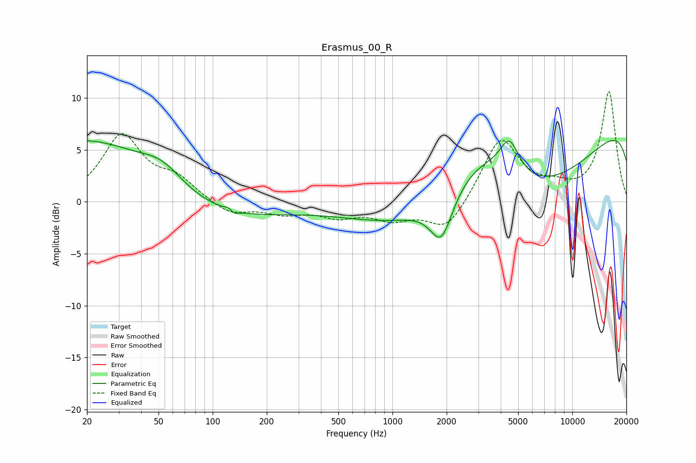

# Erasmus_00_R
See [usage instructions](https://github.com/jaakkopasanen/AutoEq#usage) for more options and info.

### Parametric EQs
Apply preamp of -6.0 dB when using parametric equalizer.

|   # | Type    |   Fc (Hz) |    Q |   Gain (dB) |
|-----|---------|-----------|------|-------------|
|   1 | Peaking |        23 | 0.33 |         7.1 |
|   2 | Peaking |        52 | 1.22 |         1.8 |
|   3 | Peaking |        72 | 0.35 |        -3.2 |
|   4 | Peaking |       127 | 5.69 |         1.5 |
|   5 | Peaking |       129 | 5.84 |        -1.6 |
|   6 | Peaking |      1871 | 2.28 |        -4.4 |
|   7 | Peaking |      3071 | 0.6  |         7.4 |
|   8 | Peaking |      4472 | 2.64 |         3.3 |
|   9 | Peaking |      5232 | 0.23 |       -14.9 |
|  10 | Peaking |     10000 | 0.18 |        14.1 |

### Fixed Band EQs
When using fixed band (also called graphic) equalizer, apply preamp of **-10.7 dB** (if available) and set gains manually with these parameters.

|   # | Type    |   Fc (Hz) |    Q |   Gain (dB) |
|-----|---------|-----------|------|-------------|
|   1 | Peaking |        31 | 1.41 |         6.3 |
|   2 | Peaking |        62 | 1.41 |         1.9 |
|   3 | Peaking |       125 | 1.41 |        -1.3 |
|   4 | Peaking |       250 | 1.41 |        -1   |
|   5 | Peaking |       500 | 1.41 |        -1.2 |
|   6 | Peaking |      1000 | 1.41 |        -1.5 |
|   7 | Peaking |      2000 | 1.41 |        -2.9 |
|   8 | Peaking |      4000 | 1.41 |         6.2 |
|   9 | Peaking |      8000 | 1.41 |         1   |
|  10 | Peaking |     16000 | 1.41 |        10.6 |

### Graphs

