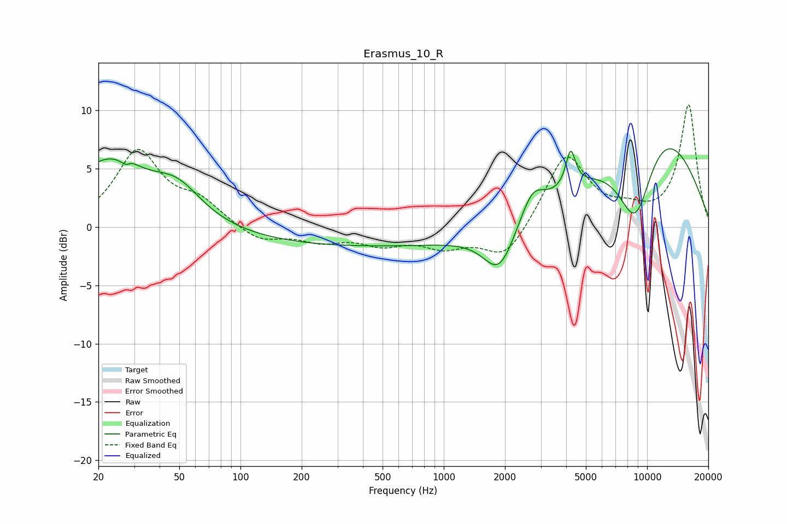

# Erasmus_10_R
See [usage instructions](https://github.com/jaakkopasanen/AutoEq#usage) for more options and info.

### Parametric EQs
Apply preamp of -6.8 dB when using parametric equalizer.

|   # | Type    |   Fc (Hz) |    Q |   Gain (dB) |
|-----|---------|-----------|------|-------------|
|   1 | Peaking |        22 | 0.75 |         5.5 |
|   2 | Peaking |        28 | 5.38 |        -2.6 |
|   3 | Peaking |        28 | 5.45 |         2.4 |
|   4 | Peaking |        49 | 1.2  |         2.6 |
|   5 | Peaking |       450 | 0.18 |        -1.7 |
|   6 | Peaking |      1875 | 1.82 |        -3.9 |
|   7 | Peaking |      2729 | 2.38 |         2.5 |
|   8 | Peaking |      4208 | 6    |         3.1 |
|   9 | Peaking |      8772 | 1.26 |        -9.5 |
|  10 | Peaking |     10000 | 0.44 |        11.2 |

### Fixed Band EQs
When using fixed band (also called graphic) equalizer, apply preamp of **-10.6 dB** (if available) and set gains manually with these parameters.

|   # | Type    |   Fc (Hz) |    Q |   Gain (dB) |
|-----|---------|-----------|------|-------------|
|   1 | Peaking |        31 | 1.41 |         6.4 |
|   2 | Peaking |        62 | 1.41 |         1.9 |
|   3 | Peaking |       125 | 1.41 |        -1.3 |
|   4 | Peaking |       250 | 1.41 |        -1.1 |
|   5 | Peaking |       500 | 1.41 |        -1.3 |
|   6 | Peaking |      1000 | 1.41 |        -1.5 |
|   7 | Peaking |      2000 | 1.41 |        -2.9 |
|   8 | Peaking |      4000 | 1.41 |         6.3 |
|   9 | Peaking |      8000 | 1.41 |         1   |
|  10 | Peaking |     16000 | 1.41 |        10.4 |

### Graphs

