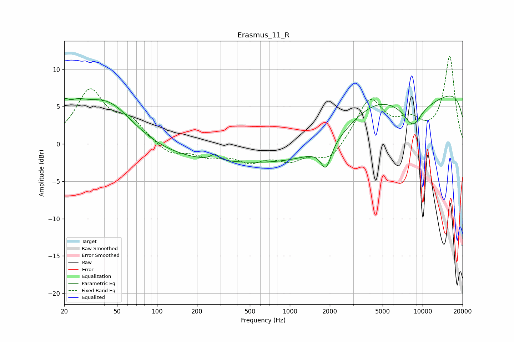

# Erasmus_11_R
See [usage instructions](https://github.com/jaakkopasanen/AutoEq#usage) for more options and info.

### Parametric EQs
Apply preamp of -6.5 dB when using parametric equalizer.

|   # | Type    |   Fc (Hz) |    Q |   Gain (dB) |
|-----|---------|-----------|------|-------------|
|   1 | Peaking |        20 | 4.83 |         1.9 |
|   2 | Peaking |        24 | 1.68 |         2.3 |
|   3 | Peaking |        42 | 0.68 |         6.2 |
|   4 | Peaking |       261 | 0.2  |        -2.4 |
|   5 | Peaking |       271 | 5.22 |         0.8 |
|   6 | Peaking |      1871 | 3.61 |        -3.2 |
|   7 | Peaking |      4288 | 0.61 |         4.5 |
|   8 | Peaking |      5366 | 0.23 |        -8.4 |
|   9 | Peaking |      8431 | 1.97 |        -2.9 |
|  10 | Peaking |     10000 | 0.18 |        11.4 |

### Fixed Band EQs
When using fixed band (also called graphic) equalizer, apply preamp of **-11.8 dB** (if available) and set gains manually with these parameters.

|   # | Type    |   Fc (Hz) |    Q |   Gain (dB) |
|-----|---------|-----------|------|-------------|
|   1 | Peaking |        31 | 1.41 |         7   |
|   2 | Peaking |        62 | 1.41 |         2.8 |
|   3 | Peaking |       125 | 1.41 |        -1.5 |
|   4 | Peaking |       250 | 1.41 |        -1.4 |
|   5 | Peaking |       500 | 1.41 |        -2   |
|   6 | Peaking |      1000 | 1.41 |        -1.9 |
|   7 | Peaking |      2000 | 1.41 |        -2.3 |
|   8 | Peaking |      4000 | 1.41 |         5.9 |
|   9 | Peaking |      8000 | 1.41 |         2.5 |
|  10 | Peaking |     16000 | 1.41 |        11.6 |

### Graphs

