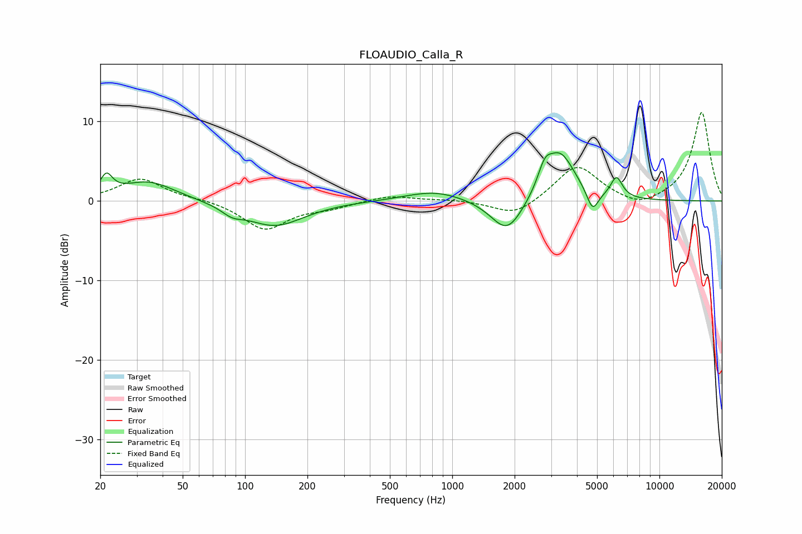

# FLOAUDIO_Calla_R
See [usage instructions](https://github.com/jaakkopasanen/AutoEq#usage) for more options and info.

### Parametric EQs
Apply preamp of -6.2 dB when using parametric equalizer.

|   # | Type    |   Fc (Hz) |    Q |   Gain (dB) |
|-----|---------|-----------|------|-------------|
|   1 | Peaking |        21 | 4.84 |         2.4 |
|   2 | Peaking |        34 | 1.09 |         2.5 |
|   3 | Peaking |        87 | 2.87 |        -0.9 |
|   4 | Peaking |       139 | 1    |        -3.1 |
|   5 | Peaking |       824 | 0.99 |         1.3 |
|   6 | Peaking |      1841 | 1.8  |        -4.4 |
|   7 | Peaking |      2793 | 4.27 |         2.5 |
|   8 | Peaking |      3314 | 1.91 |         6   |
|   9 | Peaking |      4759 | 4.89 |        -2.7 |
|  10 | Peaking |      6207 | 4.89 |         2.6 |

### Fixed Band EQs
When using fixed band (also called graphic) equalizer, apply preamp of **-11.2 dB** (if available) and set gains manually with these parameters.

|   # | Type    |   Fc (Hz) |    Q |   Gain (dB) |
|-----|---------|-----------|------|-------------|
|   1 | Peaking |        31 | 1.41 |         2.8 |
|   2 | Peaking |        62 | 1.41 |         0.2 |
|   3 | Peaking |       125 | 1.41 |        -3.6 |
|   4 | Peaking |       250 | 1.41 |        -0.7 |
|   5 | Peaking |       500 | 1.41 |         0.7 |
|   6 | Peaking |      1000 | 1.41 |         0.2 |
|   7 | Peaking |      2000 | 1.41 |        -2   |
|   8 | Peaking |      4000 | 1.41 |         4.6 |
|   9 | Peaking |      8000 | 1.41 |        -1.1 |
|  10 | Peaking |     16000 | 1.41 |        11.2 |

### Graphs

