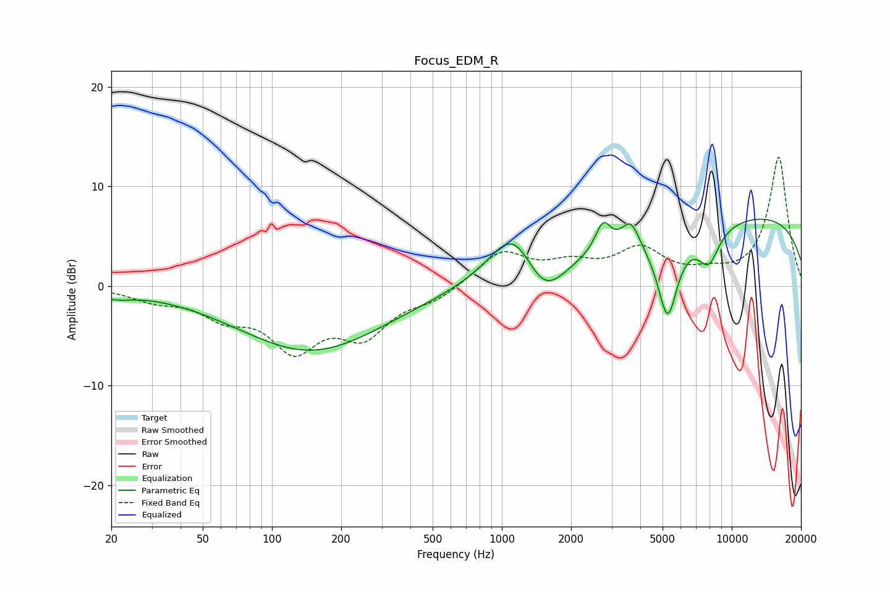

# Focus_EDM_R
See [usage instructions](https://github.com/jaakkopasanen/AutoEq#usage) for more options and info.

### Parametric EQs
Apply preamp of -6.8 dB when using parametric equalizer.

|   # | Type    |   Fc (Hz) |    Q |   Gain (dB) |
|-----|---------|-----------|------|-------------|
|   1 | Peaking |        21 | 1.85 |        -0.7 |
|   2 | Peaking |       148 | 0.44 |        -6.5 |
|   3 | Peaking |      1130 | 1.36 |         5.8 |
|   4 | Peaking |      1516 | 1.5  |        -4.7 |
|   5 | Peaking |      2755 | 4.23 |         2.9 |
|   6 | Peaking |      3634 | 3.43 |         2.9 |
|   7 | Peaking |      5267 | 1.61 |       -20   |
|   8 | Peaking |      5316 | 1.14 |        10.4 |
|   9 | Peaking |      7933 | 2.88 |        -3.4 |
|  10 | Peaking |      9916 | 0.18 |         7.6 |

### Fixed Band EQs
When using fixed band (also called graphic) equalizer, apply preamp of **-13.0 dB** (if available) and set gains manually with these parameters.

|   # | Type    |   Fc (Hz) |    Q |   Gain (dB) |
|-----|---------|-----------|------|-------------|
|   1 | Peaking |        31 | 1.41 |        -1.2 |
|   2 | Peaking |        62 | 1.41 |        -2.5 |
|   3 | Peaking |       125 | 1.41 |        -5.7 |
|   4 | Peaking |       250 | 1.41 |        -4.4 |
|   5 | Peaking |       500 | 1.41 |        -1.2 |
|   6 | Peaking |      1000 | 1.41 |         3.4 |
|   7 | Peaking |      2000 | 1.41 |         1.8 |
|   8 | Peaking |      4000 | 1.41 |         3.4 |
|   9 | Peaking |      8000 | 1.41 |         0.9 |
|  10 | Peaking |     16000 | 1.41 |        13   |

### Graphs

