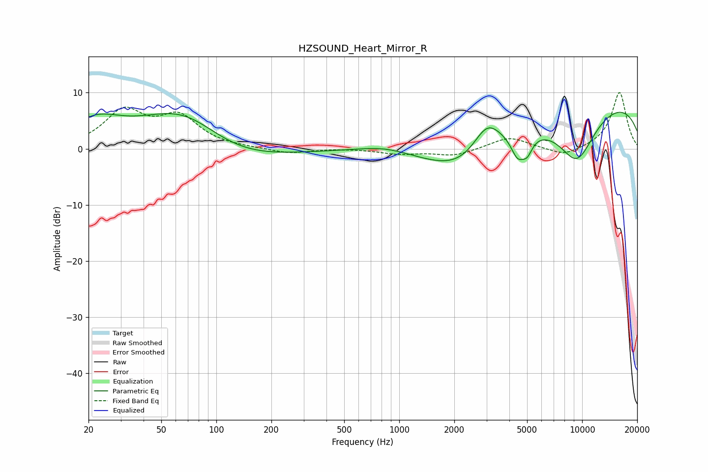

# HZSOUND_Heart_Mirror_R
See [usage instructions](https://github.com/jaakkopasanen/AutoEq#usage) for more options and info.

### Parametric EQs
Apply preamp of -6.6 dB when using parametric equalizer.

|   # | Type    |   Fc (Hz) |    Q |   Gain (dB) |
|-----|---------|-----------|------|-------------|
|   1 | Peaking |        22 | 1.06 |         4   |
|   2 | Peaking |        67 | 0.57 |         8.6 |
|   3 | Peaking |       118 | 0.53 |        -4.5 |
|   4 | Peaking |       837 | 0.97 |         1.2 |
|   5 | Peaking |      2369 | 0.6  |        -8.5 |
|   6 | Peaking |      3016 | 1.72 |         6   |
|   7 | Peaking |      4432 | 3.83 |        -3.8 |
|   8 | Peaking |      5003 | 4.61 |        -2.8 |
|   9 | Peaking |      9340 | 1.1  |       -10.2 |
|  10 | Peaking |      9829 | 0.18 |         9.6 |

### Fixed Band EQs
When using fixed band (also called graphic) equalizer, apply preamp of **-10.1 dB** (if available) and set gains manually with these parameters.

|   # | Type    |   Fc (Hz) |    Q |   Gain (dB) |
|-----|---------|-----------|------|-------------|
|   1 | Peaking |        31 | 1.41 |         6.4 |
|   2 | Peaking |        62 | 1.41 |         5.3 |
|   3 | Peaking |       125 | 1.41 |         0.1 |
|   4 | Peaking |       250 | 1.41 |        -0.9 |
|   5 | Peaking |       500 | 1.41 |         0.1 |
|   6 | Peaking |      1000 | 1.41 |        -0.9 |
|   7 | Peaking |      2000 | 1.41 |        -1.3 |
|   8 | Peaking |      4000 | 1.41 |         2.1 |
|   9 | Peaking |      8000 | 1.41 |        -1.5 |
|  10 | Peaking |     16000 | 1.41 |        10.1 |

### Graphs

