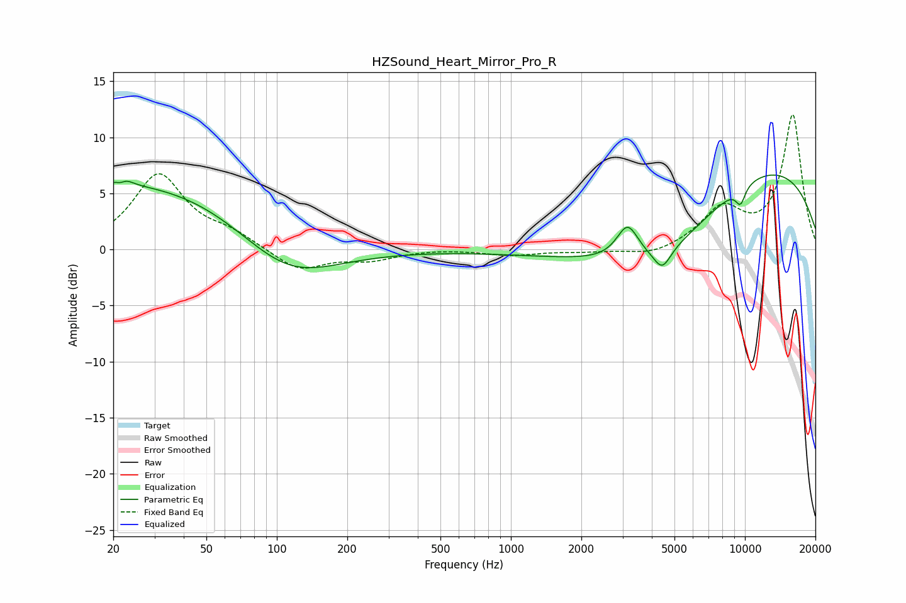

# HZSound_Heart_Mirror_Pro_R
See [usage instructions](https://github.com/jaakkopasanen/AutoEq#usage) for more options and info.

### Parametric EQs
Apply preamp of -6.7 dB when using parametric equalizer.

|   # | Type    |   Fc (Hz) |    Q |   Gain (dB) |
|-----|---------|-----------|------|-------------|
|   1 | Peaking |        22 | 3.8  |         2.5 |
|   2 | Peaking |        22 | 4.46 |        -2.6 |
|   3 | Peaking |        22 | 5.64 |         0.6 |
|   4 | Peaking |        28 | 0.25 |         6.1 |
|   5 | Peaking |       109 | 0.64 |        -4.6 |
|   6 | Peaking |      3152 | 3.04 |         3.1 |
|   7 | Peaking |      4434 | 3.85 |        -1.8 |
|   8 | Peaking |      4734 | 0.37 |       -11.7 |
|   9 | Peaking |      7997 | 0.25 |        13.5 |
|  10 | Peaking |      9573 | 5.96 |        -1.5 |

### Fixed Band EQs
When using fixed band (also called graphic) equalizer, apply preamp of **-12.1 dB** (if available) and set gains manually with these parameters.

|   # | Type    |   Fc (Hz) |    Q |   Gain (dB) |
|-----|---------|-----------|------|-------------|
|   1 | Peaking |        31 | 1.41 |         6.6 |
|   2 | Peaking |        62 | 1.41 |         1.2 |
|   3 | Peaking |       125 | 1.41 |        -1.9 |
|   4 | Peaking |       250 | 1.41 |        -0.8 |
|   5 | Peaking |       500 | 1.41 |         0.1 |
|   6 | Peaking |      1000 | 1.41 |        -0.5 |
|   7 | Peaking |      2000 | 1.41 |        -0.2 |
|   8 | Peaking |      4000 | 1.41 |        -0.7 |
|   9 | Peaking |      8000 | 1.41 |         3.4 |
|  10 | Peaking |     16000 | 1.41 |        11.9 |

### Graphs

