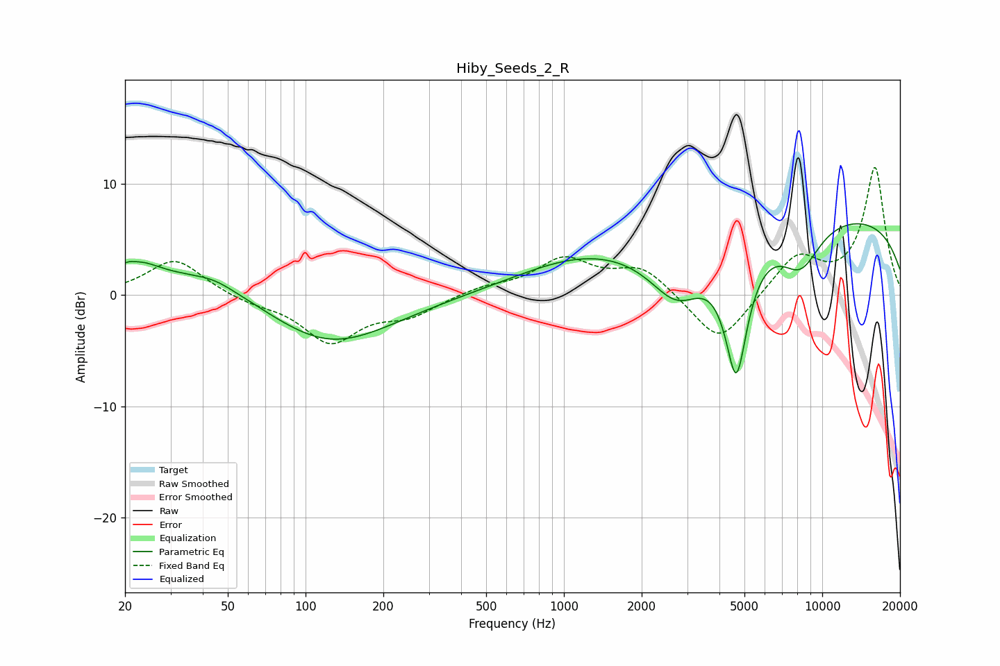

# Hiby_Seeds_2_R
See [usage instructions](https://github.com/jaakkopasanen/AutoEq#usage) for more options and info.

### Parametric EQs
Apply preamp of -6.5 dB when using parametric equalizer.

|   # | Type    |   Fc (Hz) |    Q |   Gain (dB) |
|-----|---------|-----------|------|-------------|
|   1 | Peaking |        21 | 5.07 |         0.3 |
|   2 | Peaking |        24 | 2.51 |         0.7 |
|   3 | Peaking |        28 | 0.3  |         2.7 |
|   4 | Peaking |        44 | 1.75 |         0.6 |
|   5 | Peaking |       120 | 0.57 |        -5.1 |
|   6 | Peaking |      1144 | 0.55 |         2.6 |
|   7 | Peaking |      2741 | 1.3  |        -4.9 |
|   8 | Peaking |      4649 | 3.05 |       -11.6 |
|   9 | Peaking |      8240 | 1.65 |        -4   |
|  10 | Peaking |      9864 | 0.19 |         7.4 |

### Fixed Band EQs
When using fixed band (also called graphic) equalizer, apply preamp of **-11.6 dB** (if available) and set gains manually with these parameters.

|   # | Type    |   Fc (Hz) |    Q |   Gain (dB) |
|-----|---------|-----------|------|-------------|
|   1 | Peaking |        31 | 1.41 |         3.3 |
|   2 | Peaking |        62 | 1.41 |        -0.6 |
|   3 | Peaking |       125 | 1.41 |        -4.1 |
|   4 | Peaking |       250 | 1.41 |        -1.6 |
|   5 | Peaking |       500 | 1.41 |         0.7 |
|   6 | Peaking |      1000 | 1.41 |         3.1 |
|   7 | Peaking |      2000 | 1.41 |         2.4 |
|   8 | Peaking |      4000 | 1.41 |        -4.6 |
|   9 | Peaking |      8000 | 1.41 |         3.5 |
|  10 | Peaking |     16000 | 1.41 |        11.4 |

### Graphs

