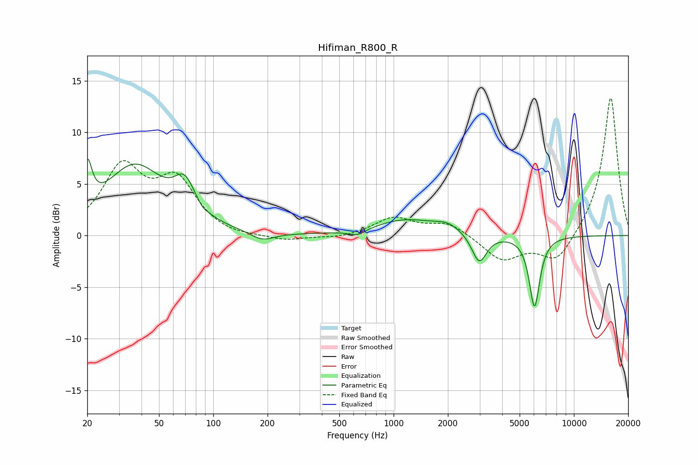

# Hifiman_R800_R
See [usage instructions](https://github.com/jaakkopasanen/AutoEq#usage) for more options and info.

### Parametric EQs
Apply preamp of -7.5 dB when using parametric equalizer.

|   # | Type    |   Fc (Hz) |    Q |   Gain (dB) |
|-----|---------|-----------|------|-------------|
|   1 | Peaking |        20 | 5.65 |         4.4 |
|   2 | Peaking |        37 | 0.86 |         6.6 |
|   3 | Peaking |        69 | 2.47 |         3.1 |
|   4 | Peaking |        87 | 5.99 |        -0.3 |
|   5 | Peaking |       187 | 2.16 |        -0.8 |
|   6 | Peaking |       627 | 3.02 |        -0.6 |
|   7 | Peaking |      1163 | 0.85 |         1.5 |
|   8 | Peaking |      1999 | 1.94 |         0.8 |
|   9 | Peaking |      2984 | 3.47 |        -2.9 |
|  10 | Peaking |      6047 | 4.77 |        -6.9 |

### Fixed Band EQs
When using fixed band (also called graphic) equalizer, apply preamp of **-13.4 dB** (if available) and set gains manually with these parameters.

|   # | Type    |   Fc (Hz) |    Q |   Gain (dB) |
|-----|---------|-----------|------|-------------|
|   1 | Peaking |        31 | 1.41 |         6.3 |
|   2 | Peaking |        62 | 1.41 |         4.9 |
|   3 | Peaking |       125 | 1.41 |        -0.3 |
|   4 | Peaking |       250 | 1.41 |        -0.5 |
|   5 | Peaking |       500 | 1.41 |        -0.3 |
|   6 | Peaking |      1000 | 1.41 |         1.7 |
|   7 | Peaking |      2000 | 1.41 |         1.2 |
|   8 | Peaking |      4000 | 1.41 |        -2.4 |
|   9 | Peaking |      8000 | 1.41 |        -2.7 |
|  10 | Peaking |     16000 | 1.41 |        13.6 |

### Graphs

