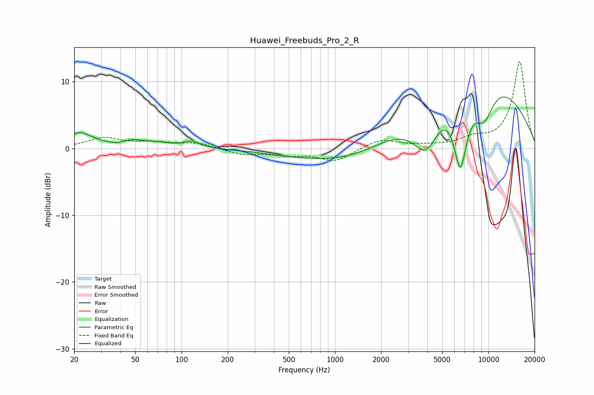

# Huawei_Freebuds_Pro_2_R
See [usage instructions](https://github.com/jaakkopasanen/AutoEq#usage) for more options and info.

### Parametric EQs
Apply preamp of -7.8 dB when using parametric equalizer.

|   # | Type    |   Fc (Hz) |    Q |   Gain (dB) |
|-----|---------|-----------|------|-------------|
|   1 | Peaking |        22 | 1.63 |         2.3 |
|   2 | Peaking |        39 | 4.65 |        -0.2 |
|   3 | Peaking |        48 | 2.1  |         0.7 |
|   4 | Peaking |        69 | 1.3  |         0.7 |
|   5 | Peaking |       117 | 2.78 |         0.9 |
|   6 | Peaking |      1774 | 0.37 |        -6.8 |
|   7 | Peaking |      3953 | 1.38 |        -8.8 |
|   8 | Peaking |      6010 | 0.31 |        17.7 |
|   9 | Peaking |      6566 | 2.46 |       -13.7 |
|  10 | Peaking |      9326 | 1.8  |        -6.1 |

### Fixed Band EQs
When using fixed band (also called graphic) equalizer, apply preamp of **-13.1 dB** (if available) and set gains manually with these parameters.

|   # | Type    |   Fc (Hz) |    Q |   Gain (dB) |
|-----|---------|-----------|------|-------------|
|   1 | Peaking |        31 | 1.41 |         1.5 |
|   2 | Peaking |        62 | 1.41 |         0.7 |
|   3 | Peaking |       125 | 1.41 |         0.8 |
|   4 | Peaking |       250 | 1.41 |        -0.9 |
|   5 | Peaking |       500 | 1.41 |        -0.8 |
|   6 | Peaking |      1000 | 1.41 |        -1.9 |
|   7 | Peaking |      2000 | 1.41 |         1.4 |
|   8 | Peaking |      4000 | 1.41 |         0.3 |
|   9 | Peaking |      8000 | 1.41 |         1.2 |
|  10 | Peaking |     16000 | 1.41 |        13   |

### Graphs

