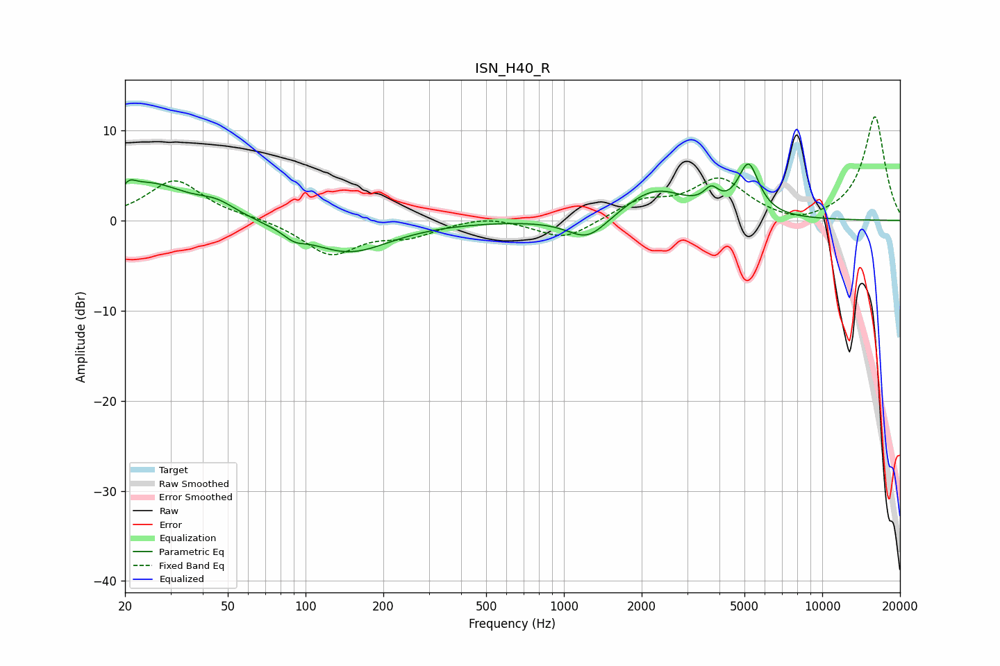

# ISN_H40_R
See [usage instructions](https://github.com/jaakkopasanen/AutoEq#usage) for more options and info.

### Parametric EQs
Apply preamp of -6.3 dB when using parametric equalizer.

|   # | Type    |   Fc (Hz) |    Q |   Gain (dB) |
|-----|---------|-----------|------|-------------|
|   1 | Peaking |        20 | 5.93 |        -2.7 |
|   2 | Peaking |        20 | 5.82 |         3.3 |
|   3 | Peaking |        25 | 0.92 |         4   |
|   4 | Peaking |        45 | 1.92 |         1.2 |
|   5 | Peaking |        90 | 3.45 |        -0.9 |
|   6 | Peaking |       146 | 0.87 |        -3.6 |
|   7 | Peaking |      1238 | 1.8  |        -2.6 |
|   8 | Peaking |      2251 | 1.15 |         3.4 |
|   9 | Peaking |      3725 | 4.84 |         1.8 |
|  10 | Peaking |      5183 | 3.41 |         5.6 |

### Fixed Band EQs
When using fixed band (also called graphic) equalizer, apply preamp of **-11.6 dB** (if available) and set gains manually with these parameters.

|   # | Type    |   Fc (Hz) |    Q |   Gain (dB) |
|-----|---------|-----------|------|-------------|
|   1 | Peaking |        31 | 1.41 |         4.5 |
|   2 | Peaking |        62 | 1.41 |         0.3 |
|   3 | Peaking |       125 | 1.41 |        -3.7 |
|   4 | Peaking |       250 | 1.41 |        -1.5 |
|   5 | Peaking |       500 | 1.41 |         0.6 |
|   6 | Peaking |      1000 | 1.41 |        -2.2 |
|   7 | Peaking |      2000 | 1.41 |         2   |
|   8 | Peaking |      4000 | 1.41 |         4.4 |
|   9 | Peaking |      8000 | 1.41 |        -0.8 |
|  10 | Peaking |     16000 | 1.41 |        11.6 |

### Graphs

