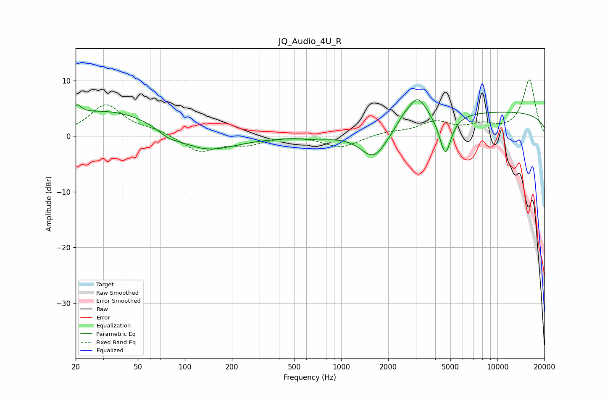

# JQ_Audio_4U_R
See [usage instructions](https://github.com/jaakkopasanen/AutoEq#usage) for more options and info.

### Parametric EQs
Apply preamp of -6.6 dB when using parametric equalizer.

|   # | Type    |   Fc (Hz) |    Q |   Gain (dB) |
|-----|---------|-----------|------|-------------|
|   1 | Peaking |        20 | 5.52 |         1.7 |
|   2 | Peaking |        33 | 0.41 |         4.8 |
|   3 | Peaking |        78 | 2.19 |        -1.1 |
|   4 | Peaking |       132 | 0.74 |        -3.5 |
|   5 | Peaking |       715 | 1.86 |        -0.4 |
|   6 | Peaking |      1623 | 1.63 |        -5.3 |
|   7 | Peaking |      2461 | 3.63 |         0.9 |
|   8 | Peaking |      3066 | 2.26 |         4.8 |
|   9 | Peaking |      4638 | 3.7  |        -7.3 |
|  10 | Peaking |     10000 | 0.18 |         4.4 |

### Fixed Band EQs
When using fixed band (also called graphic) equalizer, apply preamp of **-10.2 dB** (if available) and set gains manually with these parameters.

|   # | Type    |   Fc (Hz) |    Q |   Gain (dB) |
|-----|---------|-----------|------|-------------|
|   1 | Peaking |        31 | 1.41 |         5.6 |
|   2 | Peaking |        62 | 1.41 |         0.9 |
|   3 | Peaking |       125 | 1.41 |        -2.8 |
|   4 | Peaking |       250 | 1.41 |        -1.3 |
|   5 | Peaking |       500 | 1.41 |         0.2 |
|   6 | Peaking |      1000 | 1.41 |        -2.1 |
|   7 | Peaking |      2000 | 1.41 |         0.7 |
|   8 | Peaking |      4000 | 1.41 |         2.4 |
|   9 | Peaking |      8000 | 1.41 |         1.6 |
|  10 | Peaking |     16000 | 1.41 |        10.1 |

### Graphs

