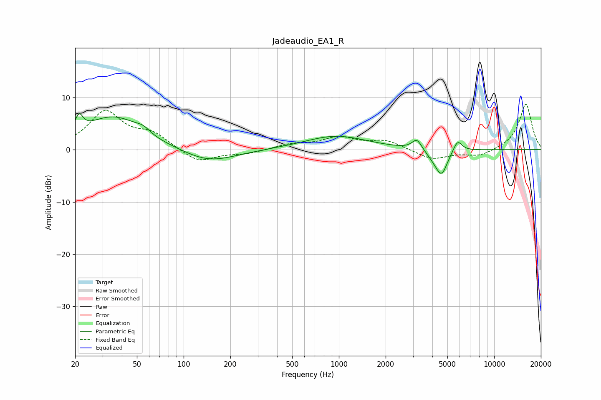

# Jadeaudio_EA1_R
See [usage instructions](https://github.com/jaakkopasanen/AutoEq#usage) for more options and info.

### Parametric EQs
Apply preamp of -7.0 dB when using parametric equalizer.

|   # | Type    |   Fc (Hz) |    Q |   Gain (dB) |
|-----|---------|-----------|------|-------------|
|   1 | Peaking |        21 | 5.78 |         3   |
|   2 | Peaking |        35 | 0.73 |         6.4 |
|   3 | Peaking |        56 | 2.65 |         1.9 |
|   4 | Peaking |        57 | 2.08 |        -1.2 |
|   5 | Peaking |       144 | 0.82 |        -2.6 |
|   6 | Peaking |       958 | 0.71 |         2.6 |
|   7 | Peaking |      3181 | 4.57 |         2.1 |
|   8 | Peaking |      4161 | 2.56 |        -1.4 |
|   9 | Peaking |      4595 | 3.78 |        -4.1 |
|  10 | Peaking |      5812 | 4.82 |         2.3 |

### Fixed Band EQs
When using fixed band (also called graphic) equalizer, apply preamp of **-8.8 dB** (if available) and set gains manually with these parameters.

|   # | Type    |   Fc (Hz) |    Q |   Gain (dB) |
|-----|---------|-----------|------|-------------|
|   1 | Peaking |        31 | 1.41 |         7.1 |
|   2 | Peaking |        62 | 1.41 |         2.7 |
|   3 | Peaking |       125 | 1.41 |        -2.6 |
|   4 | Peaking |       250 | 1.41 |        -0.7 |
|   5 | Peaking |       500 | 1.41 |         1   |
|   6 | Peaking |      1000 | 1.41 |         2.2 |
|   7 | Peaking |      2000 | 1.41 |         1.6 |
|   8 | Peaking |      4000 | 1.41 |        -1.9 |
|   9 | Peaking |      8000 | 1.41 |        -1.3 |
|  10 | Peaking |     16000 | 1.41 |         8.8 |

### Graphs

