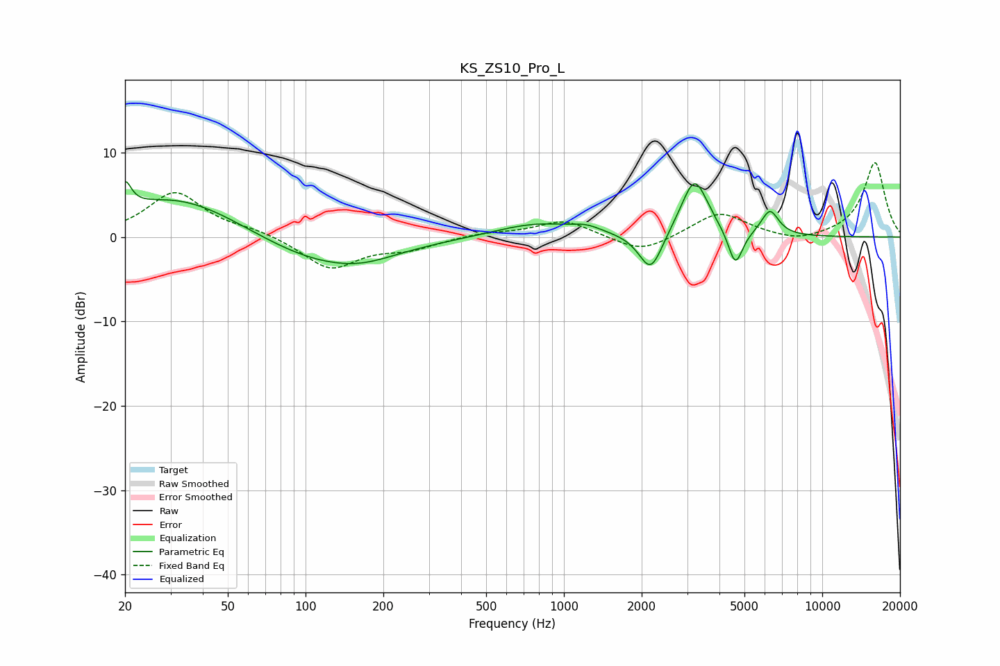

# KS_ZS10_Pro_L
See [usage instructions](https://github.com/jaakkopasanen/AutoEq#usage) for more options and info.

### Parametric EQs
Apply preamp of -6.7 dB when using parametric equalizer.

|   # | Type    |   Fc (Hz) |    Q |   Gain (dB) |
|-----|---------|-----------|------|-------------|
|   1 | Peaking |        20 | 5.96 |         3.1 |
|   2 | Peaking |        32 | 0.56 |         5   |
|   3 | Peaking |       113 | 0.56 |        -3.4 |
|   4 | Peaking |       167 | 1.12 |        -0.9 |
|   5 | Peaking |       786 | 0.87 |         1.7 |
|   6 | Peaking |      1224 | 2.57 |         0.7 |
|   7 | Peaking |      2168 | 3.08 |        -4.8 |
|   8 | Peaking |      3204 | 2.66 |         7   |
|   9 | Peaking |      4611 | 4.97 |        -4.4 |
|  10 | Peaking |      6272 | 4.03 |         3   |

### Fixed Band EQs
When using fixed band (also called graphic) equalizer, apply preamp of **-8.9 dB** (if available) and set gains manually with these parameters.

|   # | Type    |   Fc (Hz) |    Q |   Gain (dB) |
|-----|---------|-----------|------|-------------|
|   1 | Peaking |        31 | 1.41 |         5.3 |
|   2 | Peaking |        62 | 1.41 |         0.7 |
|   3 | Peaking |       125 | 1.41 |        -3.8 |
|   4 | Peaking |       250 | 1.41 |        -1.2 |
|   5 | Peaking |       500 | 1.41 |         0.5 |
|   6 | Peaking |      1000 | 1.41 |         2   |
|   7 | Peaking |      2000 | 1.41 |        -2   |
|   8 | Peaking |      4000 | 1.41 |         3   |
|   9 | Peaking |      8000 | 1.41 |        -0.8 |
|  10 | Peaking |     16000 | 1.41 |         8.9 |

### Graphs

