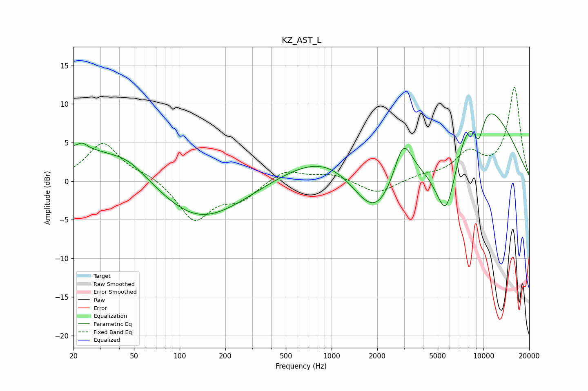

# KZ_AST_L
See [usage instructions](https://github.com/jaakkopasanen/AutoEq#usage) for more options and info.

### Parametric EQs
Apply preamp of -8.8 dB when using parametric equalizer.

|   # | Type    |   Fc (Hz) |    Q |   Gain (dB) |
|-----|---------|-----------|------|-------------|
|   1 | Peaking |        23 | 4.41 |         0.7 |
|   2 | Peaking |        23 | 0.27 |         4.8 |
|   3 | Peaking |        46 | 1.33 |         1   |
|   4 | Peaking |       127 | 0.48 |        -6.1 |
|   5 | Peaking |      1078 | 0.48 |         5.1 |
|   6 | Peaking |      1927 | 0.8  |        -9   |
|   7 | Peaking |      2957 | 2.3  |         5.7 |
|   8 | Peaking |      5695 | 1.53 |       -12.5 |
|   9 | Peaking |      8646 | 0.5  |        13.6 |
|  10 | Peaking |      9287 | 3.31 |        -4.7 |

### Fixed Band EQs
When using fixed band (also called graphic) equalizer, apply preamp of **-12.3 dB** (if available) and set gains manually with these parameters.

|   # | Type    |   Fc (Hz) |    Q |   Gain (dB) |
|-----|---------|-----------|------|-------------|
|   1 | Peaking |        31 | 1.41 |         4.9 |
|   2 | Peaking |        62 | 1.41 |         0.8 |
|   3 | Peaking |       125 | 1.41 |        -5   |
|   4 | Peaking |       250 | 1.41 |        -2.2 |
|   5 | Peaking |       500 | 1.41 |         1.6 |
|   6 | Peaking |      1000 | 1.41 |         0.9 |
|   7 | Peaking |      2000 | 1.41 |        -1.7 |
|   8 | Peaking |      4000 | 1.41 |         0.6 |
|   9 | Peaking |      8000 | 1.41 |         3.3 |
|  10 | Peaking |     16000 | 1.41 |        12.1 |

### Graphs

