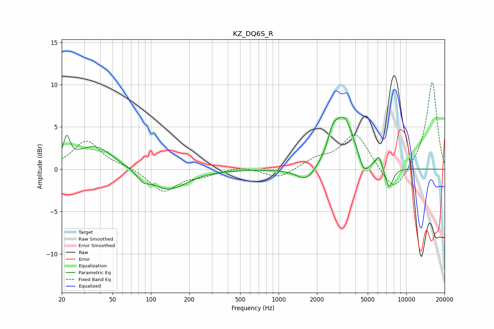

# KZ_DQ6S_R
See [usage instructions](https://github.com/jaakkopasanen/AutoEq#usage) for more options and info.

### Parametric EQs
Apply preamp of -6.2 dB when using parametric equalizer.

|   # | Type    |   Fc (Hz) |    Q |   Gain (dB) |
|-----|---------|-----------|------|-------------|
|   1 | Peaking |        22 | 5.63 |         2.8 |
|   2 | Peaking |        36 | 1    |         2.8 |
|   3 | Peaking |        87 | 3.44 |        -0.8 |
|   4 | Peaking |       137 | 0.99 |        -2.5 |
|   5 | Peaking |      1656 | 1.77 |        -1.8 |
|   6 | Peaking |      2660 | 3.75 |         2.1 |
|   7 | Peaking |      3269 | 1.74 |         6   |
|   8 | Peaking |      4650 | 3.54 |        -2   |
|   9 | Peaking |      6113 | 5.53 |         1.4 |
|  10 | Peaking |      7347 | 4.23 |        -2.5 |

### Fixed Band EQs
When using fixed band (also called graphic) equalizer, apply preamp of **-10.4 dB** (if available) and set gains manually with these parameters.

|   # | Type    |   Fc (Hz) |    Q |   Gain (dB) |
|-----|---------|-----------|------|-------------|
|   1 | Peaking |        31 | 1.41 |         3.4 |
|   2 | Peaking |        62 | 1.41 |         0.3 |
|   3 | Peaking |       125 | 1.41 |        -2.7 |
|   4 | Peaking |       250 | 1.41 |        -0.6 |
|   5 | Peaking |       500 | 1.41 |         0.4 |
|   6 | Peaking |      1000 | 1.41 |        -1.1 |
|   7 | Peaking |      2000 | 1.41 |         1.1 |
|   8 | Peaking |      4000 | 1.41 |         4.2 |
|   9 | Peaking |      8000 | 1.41 |        -3.1 |
|  10 | Peaking |     16000 | 1.41 |        10.5 |

### Graphs

