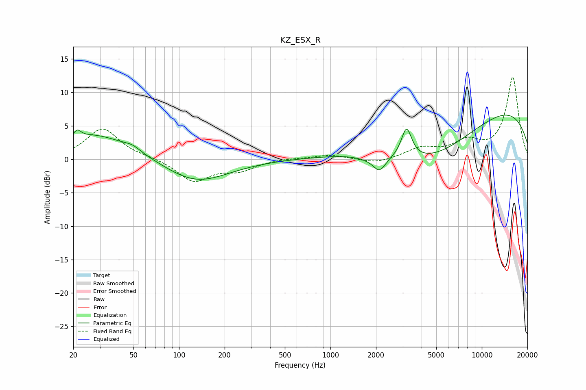

# KZ_ESX_R
See [usage instructions](https://github.com/jaakkopasanen/AutoEq#usage) for more options and info.

### Parametric EQs
Apply preamp of -6.7 dB when using parametric equalizer.

|   # | Type    |   Fc (Hz) |    Q |   Gain (dB) |
|-----|---------|-----------|------|-------------|
|   1 | Peaking |        20 | 2.67 |        -0.6 |
|   2 | Peaking |        21 | 5.43 |         1.4 |
|   3 | Peaking |        26 | 0.54 |         3.9 |
|   4 | Peaking |        49 | 2.77 |         0.6 |
|   5 | Peaking |       129 | 0.67 |        -3.5 |
|   6 | Peaking |      1752 | 1.83 |        -0.3 |
|   7 | Peaking |      2108 | 3.35 |        -2.2 |
|   8 | Peaking |      3182 | 4.14 |         4.6 |
|   9 | Peaking |      4542 | 0.41 |        -8.5 |
|  10 | Peaking |      8393 | 0.18 |         9.9 |

### Fixed Band EQs
When using fixed band (also called graphic) equalizer, apply preamp of **-12.4 dB** (if available) and set gains manually with these parameters.

|   # | Type    |   Fc (Hz) |    Q |   Gain (dB) |
|-----|---------|-----------|------|-------------|
|   1 | Peaking |        31 | 1.41 |         4.6 |
|   2 | Peaking |        62 | 1.41 |         0.2 |
|   3 | Peaking |       125 | 1.41 |        -3.3 |
|   4 | Peaking |       250 | 1.41 |        -1.5 |
|   5 | Peaking |       500 | 1.41 |         0.2 |
|   6 | Peaking |      1000 | 1.41 |         0.7 |
|   7 | Peaking |      2000 | 1.41 |        -0.7 |
|   8 | Peaking |      4000 | 1.41 |         1.5 |
|   9 | Peaking |      8000 | 1.41 |         2.3 |
|  10 | Peaking |     16000 | 1.41 |        12.2 |

### Graphs

