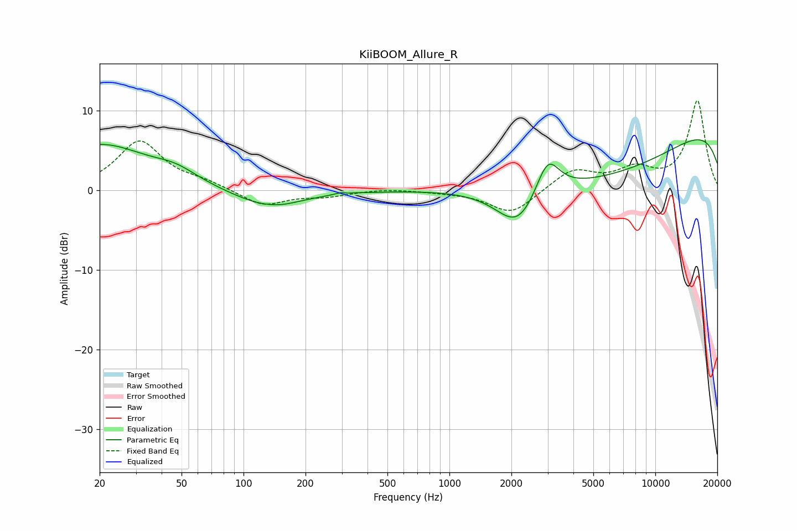

# KiiBOOM_Allure_R
See [usage instructions](https://github.com/jaakkopasanen/AutoEq#usage) for more options and info.

### Parametric EQs
Apply preamp of -6.4 dB when using parametric equalizer.

|   # | Type    |   Fc (Hz) |    Q |   Gain (dB) |
|-----|---------|-----------|------|-------------|
|   1 | Peaking |        20 | 0.59 |         5.7 |
|   2 | Peaking |        47 | 1.37 |         1.3 |
|   3 | Peaking |       129 | 0.84 |        -2.2 |
|   4 | Peaking |       156 | 2.26 |        -0.1 |
|   5 | Peaking |       312 | 5.25 |         2.7 |
|   6 | Peaking |       313 | 5.55 |        -2.6 |
|   7 | Peaking |      2148 | 1.37 |        -5.1 |
|   8 | Peaking |      2999 | 2.44 |         4.9 |
|   9 | Peaking |      5916 | 0.31 |        -7.7 |
|  10 | Peaking |     10000 | 0.18 |        10.5 |

### Fixed Band EQs
When using fixed band (also called graphic) equalizer, apply preamp of **-11.4 dB** (if available) and set gains manually with these parameters.

|   # | Type    |   Fc (Hz) |    Q |   Gain (dB) |
|-----|---------|-----------|------|-------------|
|   1 | Peaking |        31 | 1.41 |         6.1 |
|   2 | Peaking |        62 | 1.41 |         0.9 |
|   3 | Peaking |       125 | 1.41 |        -2   |
|   4 | Peaking |       250 | 1.41 |        -0.7 |
|   5 | Peaking |       500 | 1.41 |         0.2 |
|   6 | Peaking |      1000 | 1.41 |        -0.2 |
|   7 | Peaking |      2000 | 1.41 |        -3   |
|   8 | Peaking |      4000 | 1.41 |         2.6 |
|   9 | Peaking |      8000 | 1.41 |         2.3 |
|  10 | Peaking |     16000 | 1.41 |        11.2 |

### Graphs

