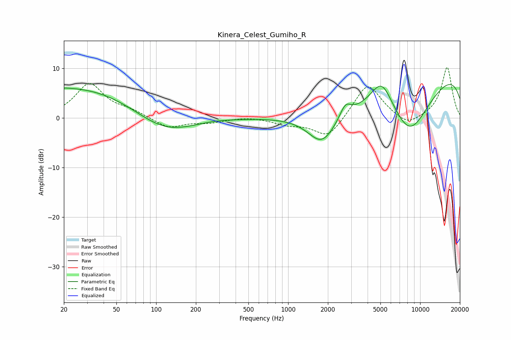

# Kinera_Celest_Gumiho_R
See [usage instructions](https://github.com/jaakkopasanen/AutoEq#usage) for more options and info.

### Parametric EQs
Apply preamp of -6.9 dB when using parametric equalizer.

|   # | Type    |   Fc (Hz) |    Q |   Gain (dB) |
|-----|---------|-----------|------|-------------|
|   1 | Peaking |        21 | 5.11 |         0.1 |
|   2 | Peaking |        25 | 0.27 |         6.4 |
|   3 | Peaking |       113 | 0.61 |        -4.4 |
|   4 | Peaking |       275 | 0.99 |         0.4 |
|   5 | Peaking |      1801 | 1.32 |        -6.1 |
|   6 | Peaking |      2708 | 0.46 |        -2.7 |
|   7 | Peaking |      2712 | 3.41 |         2.7 |
|   8 | Peaking |      5119 | 1.62 |         6.5 |
|   9 | Peaking |      8307 | 0.65 |       -13.9 |
|  10 | Peaking |     10000 | 0.18 |        12.1 |

### Fixed Band EQs
When using fixed band (also called graphic) equalizer, apply preamp of **-10.3 dB** (if available) and set gains manually with these parameters.

|   # | Type    |   Fc (Hz) |    Q |   Gain (dB) |
|-----|---------|-----------|------|-------------|
|   1 | Peaking |        31 | 1.41 |         6.8 |
|   2 | Peaking |        62 | 1.41 |         1.2 |
|   3 | Peaking |       125 | 1.41 |        -2.1 |
|   4 | Peaking |       250 | 1.41 |        -0.8 |
|   5 | Peaking |       500 | 1.41 |         0.3 |
|   6 | Peaking |      1000 | 1.41 |        -1.2 |
|   7 | Peaking |      2000 | 1.41 |        -4.2 |
|   8 | Peaking |      4000 | 1.41 |         7.2 |
|   9 | Peaking |      8000 | 1.41 |        -2   |
|  10 | Peaking |     16000 | 1.41 |        10.3 |

### Graphs

