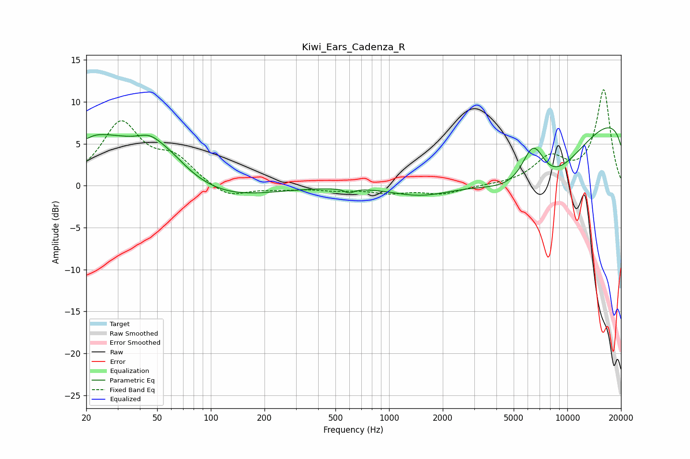

# Kiwi_Ears_Cadenza_R
See [usage instructions](https://github.com/jaakkopasanen/AutoEq#usage) for more options and info.

### Parametric EQs
Apply preamp of -7.0 dB when using parametric equalizer.

|   # | Type    |   Fc (Hz) |    Q |   Gain (dB) |
|-----|---------|-----------|------|-------------|
|   1 | Peaking |        20 | 5.33 |        -0.7 |
|   2 | Peaking |        20 | 0.26 |         6.5 |
|   3 | Peaking |        45 | 2.14 |         1.3 |
|   4 | Peaking |        58 | 1.45 |         1.2 |
|   5 | Peaking |       102 | 0.53 |        -2.9 |
|   6 | Peaking |       598 | 5.64 |        -0.5 |
|   7 | Peaking |      1507 | 0.76 |        -1.8 |
|   8 | Peaking |      6442 | 1.9  |         6.2 |
|   9 | Peaking |      6967 | 0.34 |       -17.1 |
|  10 | Peaking |     10000 | 0.18 |        16.5 |

### Fixed Band EQs
When using fixed band (also called graphic) equalizer, apply preamp of **-11.5 dB** (if available) and set gains manually with these parameters.

|   # | Type    |   Fc (Hz) |    Q |   Gain (dB) |
|-----|---------|-----------|------|-------------|
|   1 | Peaking |        31 | 1.41 |         7.3 |
|   2 | Peaking |        62 | 1.41 |         2.8 |
|   3 | Peaking |       125 | 1.41 |        -1.6 |
|   4 | Peaking |       250 | 1.41 |        -0.3 |
|   5 | Peaking |       500 | 1.41 |        -0.4 |
|   6 | Peaking |      1000 | 1.41 |        -0.8 |
|   7 | Peaking |      2000 | 1.41 |        -0.9 |
|   8 | Peaking |      4000 | 1.41 |         0   |
|   9 | Peaking |      8000 | 1.41 |         3.1 |
|  10 | Peaking |     16000 | 1.41 |        11.4 |

### Graphs

