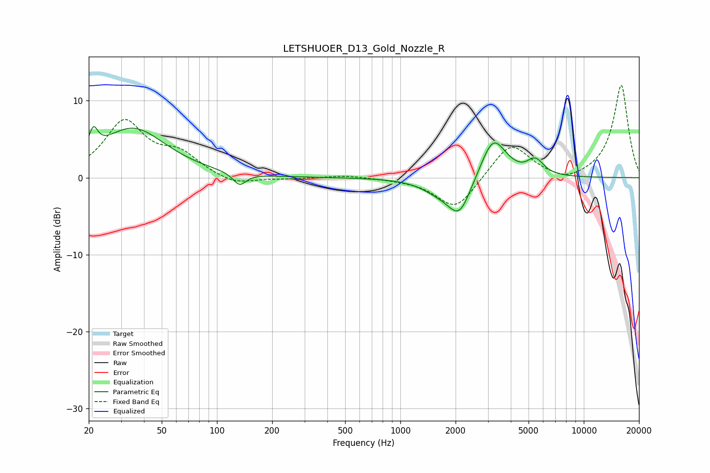

# LETSHUOER_D13_Gold_Nozzle_R
See [usage instructions](https://github.com/jaakkopasanen/AutoEq#usage) for more options and info.

### Parametric EQs
Apply preamp of -6.7 dB when using parametric equalizer.

|   # | Type    |   Fc (Hz) |    Q |   Gain (dB) |
|-----|---------|-----------|------|-------------|
|   1 | Peaking |        21 | 5.95 |         2.8 |
|   2 | Peaking |        35 | 0.78 |         6.4 |
|   3 | Peaking |       133 | 3.99 |        -1.6 |
|   4 | Peaking |      1594 | 1.5  |        -1.2 |
|   5 | Peaking |      2030 | 1.16 |        -0.2 |
|   6 | Peaking |      2033 | 1.38 |        -0.3 |
|   7 | Peaking |      2099 | 2.23 |        -4.4 |
|   8 | Peaking |      3208 | 2.01 |         5.6 |
|   9 | Peaking |      5209 | 4.16 |         0.5 |
|  10 | Peaking |      5552 | 3.25 |         1.5 |

### Fixed Band EQs
When using fixed band (also called graphic) equalizer, apply preamp of **-12.1 dB** (if available) and set gains manually with these parameters.

|   # | Type    |   Fc (Hz) |    Q |   Gain (dB) |
|-----|---------|-----------|------|-------------|
|   1 | Peaking |        31 | 1.41 |         7.1 |
|   2 | Peaking |        62 | 1.41 |         2.7 |
|   3 | Peaking |       125 | 1.41 |        -1.1 |
|   4 | Peaking |       250 | 1.41 |        -0.2 |
|   5 | Peaking |       500 | 1.41 |         0.3 |
|   6 | Peaking |      1000 | 1.41 |        -0.1 |
|   7 | Peaking |      2000 | 1.41 |        -4.3 |
|   8 | Peaking |      4000 | 1.41 |         4.6 |
|   9 | Peaking |      8000 | 1.41 |        -0.9 |
|  10 | Peaking |     16000 | 1.41 |        12.1 |

### Graphs

