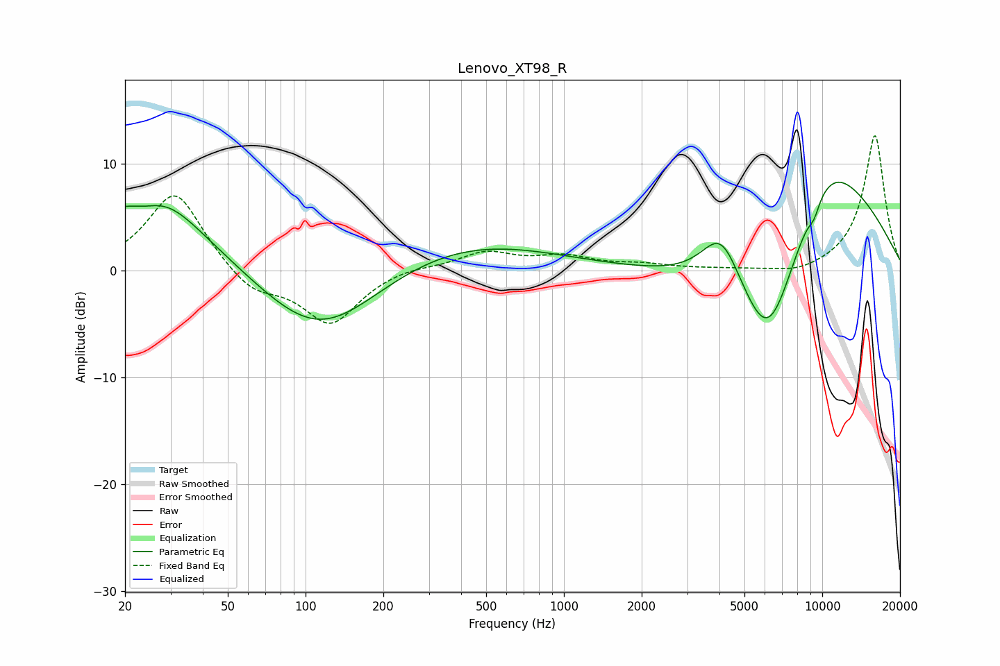

# Lenovo_XT98_R
See [usage instructions](https://github.com/jaakkopasanen/AutoEq#usage) for more options and info.

### Parametric EQs
Apply preamp of -8.3 dB when using parametric equalizer.

|   # | Type    |   Fc (Hz) |    Q |   Gain (dB) |
|-----|---------|-----------|------|-------------|
|   1 | Peaking |        23 | 0.6  |         6.2 |
|   2 | Peaking |        24 | 1.66 |        -2.5 |
|   3 | Peaking |        26 | 1.11 |         2.8 |
|   4 | Peaking |       111 | 0.68 |        -3.5 |
|   5 | Peaking |       116 | 0.48 |        -6.1 |
|   6 | Peaking |       202 | 0.25 |         4.6 |
|   7 | Peaking |      4075 | 1.76 |         5.5 |
|   8 | Peaking |      6198 | 0.87 |       -15.2 |
|   9 | Peaking |      9303 | 5.82 |        -1.1 |
|  10 | Peaking |      9986 | 0.51 |        13.9 |

### Fixed Band EQs
When using fixed band (also called graphic) equalizer, apply preamp of **-12.7 dB** (if available) and set gains manually with these parameters.

|   # | Type    |   Fc (Hz) |    Q |   Gain (dB) |
|-----|---------|-----------|------|-------------|
|   1 | Peaking |        31 | 1.41 |         7.5 |
|   2 | Peaking |        62 | 1.41 |        -2.2 |
|   3 | Peaking |       125 | 1.41 |        -5   |
|   4 | Peaking |       250 | 1.41 |         0.4 |
|   5 | Peaking |       500 | 1.41 |         1.7 |
|   6 | Peaking |      1000 | 1.41 |         1.2 |
|   7 | Peaking |      2000 | 1.41 |         0.5 |
|   8 | Peaking |      4000 | 1.41 |         0.1 |
|   9 | Peaking |      8000 | 1.41 |        -0.6 |
|  10 | Peaking |     16000 | 1.41 |        12.7 |

### Graphs

