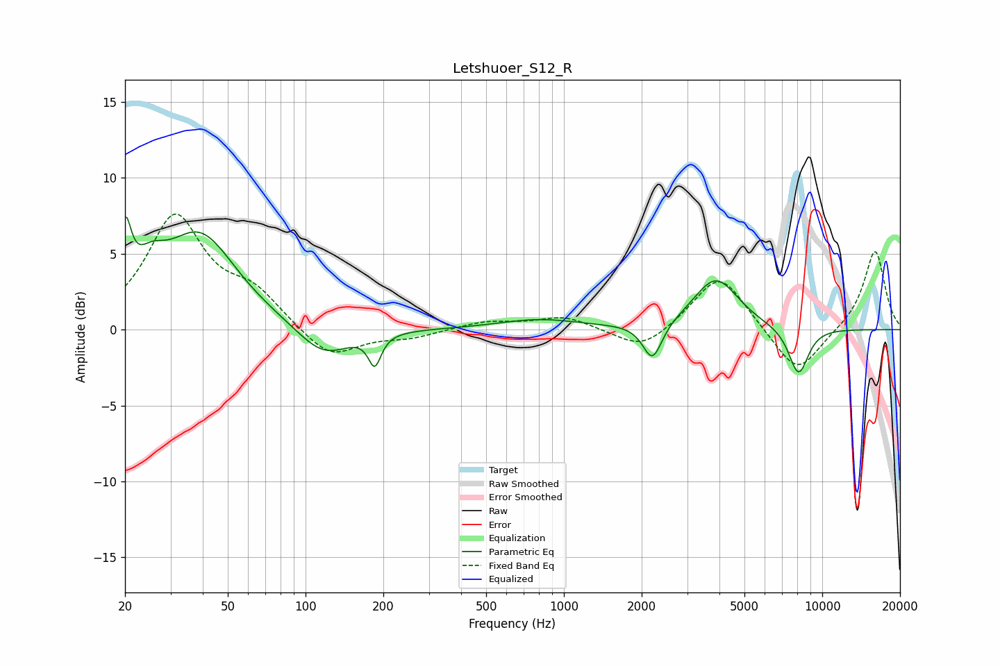

# Letshuoer_S12_R
See [usage instructions](https://github.com/jaakkopasanen/AutoEq#usage) for more options and info.

### Parametric EQs
Apply preamp of -7.5 dB when using parametric equalizer.

|   # | Type    |   Fc (Hz) |    Q |   Gain (dB) |
|-----|---------|-----------|------|-------------|
|   1 | Peaking |        20 | 6    |         4.5 |
|   2 | Peaking |        25 | 2.36 |         1.9 |
|   3 | Peaking |        39 | 1    |         6.1 |
|   4 | Peaking |       117 | 1.37 |        -2.1 |
|   5 | Peaking |       185 | 5.9  |        -2   |
|   6 | Peaking |       800 | 0.9  |         0.6 |
|   7 | Peaking |      2202 | 3.82 |        -2.5 |
|   8 | Peaking |      3875 | 1.61 |         3.4 |
|   9 | Peaking |      8043 | 3.43 |        -2.7 |
|  10 | Peaking |      8362 | 3.77 |        -0.5 |

### Fixed Band EQs
When using fixed band (also called graphic) equalizer, apply preamp of **-7.7 dB** (if available) and set gains manually with these parameters.

|   # | Type    |   Fc (Hz) |    Q |   Gain (dB) |
|-----|---------|-----------|------|-------------|
|   1 | Peaking |        31 | 1.41 |         7.3 |
|   2 | Peaking |        62 | 1.41 |         2.1 |
|   3 | Peaking |       125 | 1.41 |        -2   |
|   4 | Peaking |       250 | 1.41 |        -0.5 |
|   5 | Peaking |       500 | 1.41 |         0.5 |
|   6 | Peaking |      1000 | 1.41 |         0.9 |
|   7 | Peaking |      2000 | 1.41 |        -1.5 |
|   8 | Peaking |      4000 | 1.41 |         3.8 |
|   9 | Peaking |      8000 | 1.41 |        -3.1 |
|  10 | Peaking |     16000 | 1.41 |         5.3 |

### Graphs

