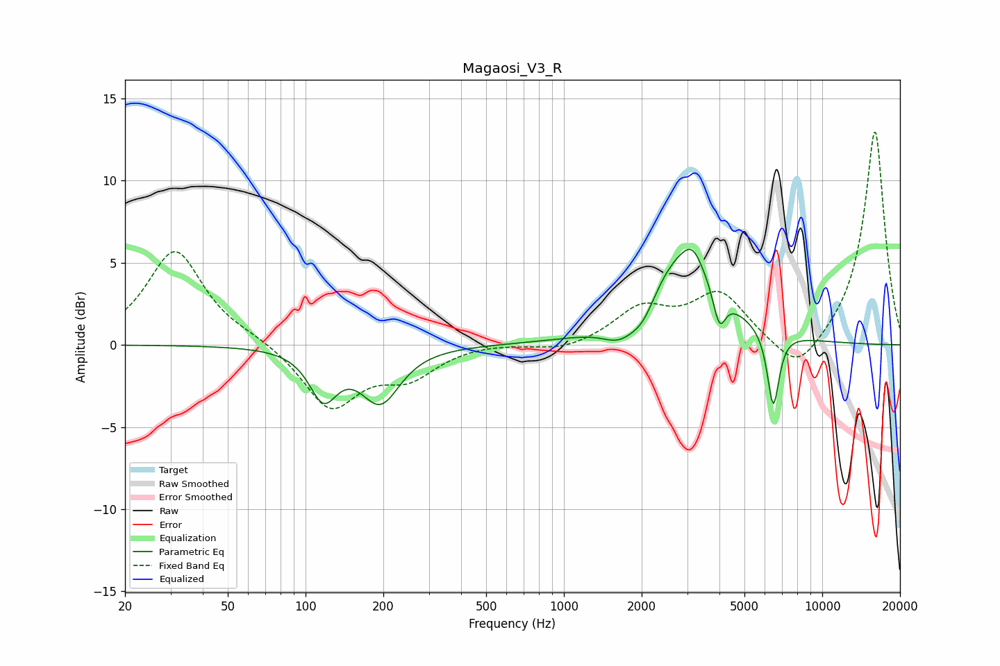

# Magaosi_V3_R
See [usage instructions](https://github.com/jaakkopasanen/AutoEq#usage) for more options and info.

### Parametric EQs
Apply preamp of -5.9 dB when using parametric equalizer.

|   # | Type    |   Fc (Hz) |    Q |   Gain (dB) |
|-----|---------|-----------|------|-------------|
|   1 | Peaking |       117 | 2.65 |        -2.9 |
|   2 | Peaking |       195 | 1.96 |        -3.9 |
|   3 | Peaking |       195 | 2.54 |         0.6 |
|   4 | Peaking |      1625 | 2.29 |        -0.6 |
|   5 | Peaking |      1709 | 1.81 |        -0.8 |
|   6 | Peaking |      2031 | 2.89 |        -1.2 |
|   7 | Peaking |      2868 | 1.02 |         5.6 |
|   8 | Peaking |      3147 | 3.94 |         1   |
|   9 | Peaking |      3997 | 5.8  |        -2.3 |
|  10 | Peaking |      6463 | 6    |        -4.7 |

### Fixed Band EQs
When using fixed band (also called graphic) equalizer, apply preamp of **-13.1 dB** (if available) and set gains manually with these parameters.

|   # | Type    |   Fc (Hz) |    Q |   Gain (dB) |
|-----|---------|-----------|------|-------------|
|   1 | Peaking |        31 | 1.41 |         5.8 |
|   2 | Peaking |        62 | 1.41 |         0.3 |
|   3 | Peaking |       125 | 1.41 |        -3.8 |
|   4 | Peaking |       250 | 1.41 |        -1.7 |
|   5 | Peaking |       500 | 1.41 |         0.1 |
|   6 | Peaking |      1000 | 1.41 |        -0.4 |
|   7 | Peaking |      2000 | 1.41 |         2.1 |
|   8 | Peaking |      4000 | 1.41 |         3   |
|   9 | Peaking |      8000 | 1.41 |        -2.1 |
|  10 | Peaking |     16000 | 1.41 |        13.1 |

### Graphs

