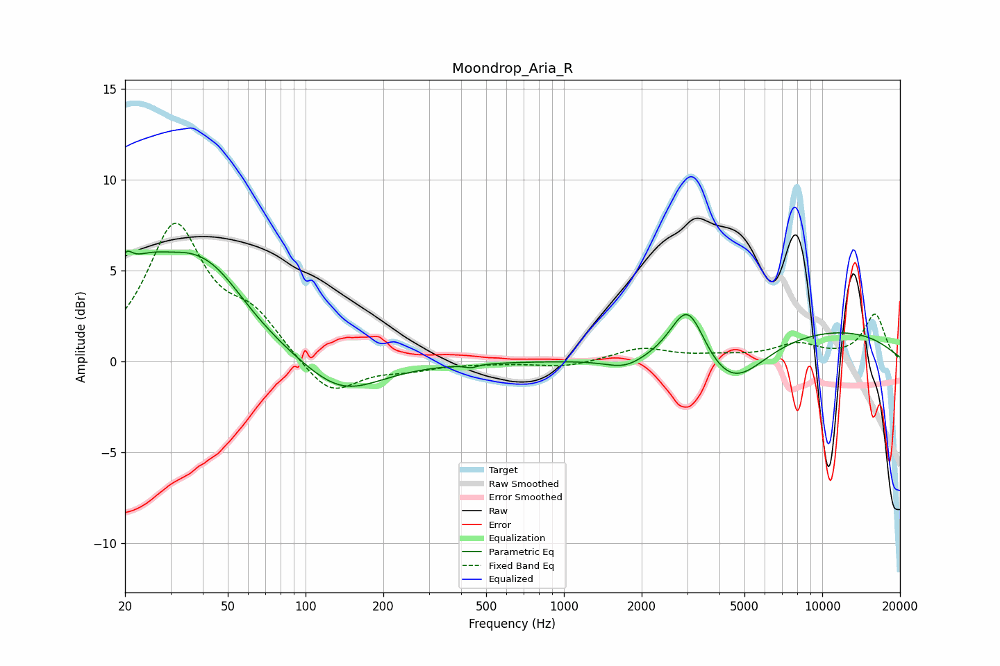

# Moondrop_Aria_R
See [usage instructions](https://github.com/jaakkopasanen/AutoEq#usage) for more options and info.

### Parametric EQs
Apply preamp of -6.2 dB when using parametric equalizer.

|   # | Type    |   Fc (Hz) |    Q |   Gain (dB) |
|-----|---------|-----------|------|-------------|
|   1 | Peaking |        20 | 5.99 |         1   |
|   2 | Peaking |        28 | 0.74 |         6.6 |
|   3 | Peaking |        29 | 1.56 |        -1.3 |
|   4 | Peaking |        45 | 1.13 |         1.6 |
|   5 | Peaking |       137 | 0.93 |        -2   |
|   6 | Peaking |       438 | 5.96 |        -0.2 |
|   7 | Peaking |      1726 | 1.85 |        -0.6 |
|   8 | Peaking |      3017 | 2.12 |         3.3 |
|   9 | Peaking |      4449 | 1.08 |        -2.7 |
|  10 | Peaking |      9574 | 0.31 |         1.8 |

### Fixed Band EQs
When using fixed band (also called graphic) equalizer, apply preamp of **-7.7 dB** (if available) and set gains manually with these parameters.

|   # | Type    |   Fc (Hz) |    Q |   Gain (dB) |
|-----|---------|-----------|------|-------------|
|   1 | Peaking |        31 | 1.41 |         7.3 |
|   2 | Peaking |        62 | 1.41 |         2.1 |
|   3 | Peaking |       125 | 1.41 |        -2   |
|   4 | Peaking |       250 | 1.41 |        -0.4 |
|   5 | Peaking |       500 | 1.41 |        -0.1 |
|   6 | Peaking |      1000 | 1.41 |        -0.3 |
|   7 | Peaking |      2000 | 1.41 |         0.7 |
|   8 | Peaking |      4000 | 1.41 |         0.2 |
|   9 | Peaking |      8000 | 1.41 |         0.9 |
|  10 | Peaking |     16000 | 1.41 |         2.6 |

### Graphs

