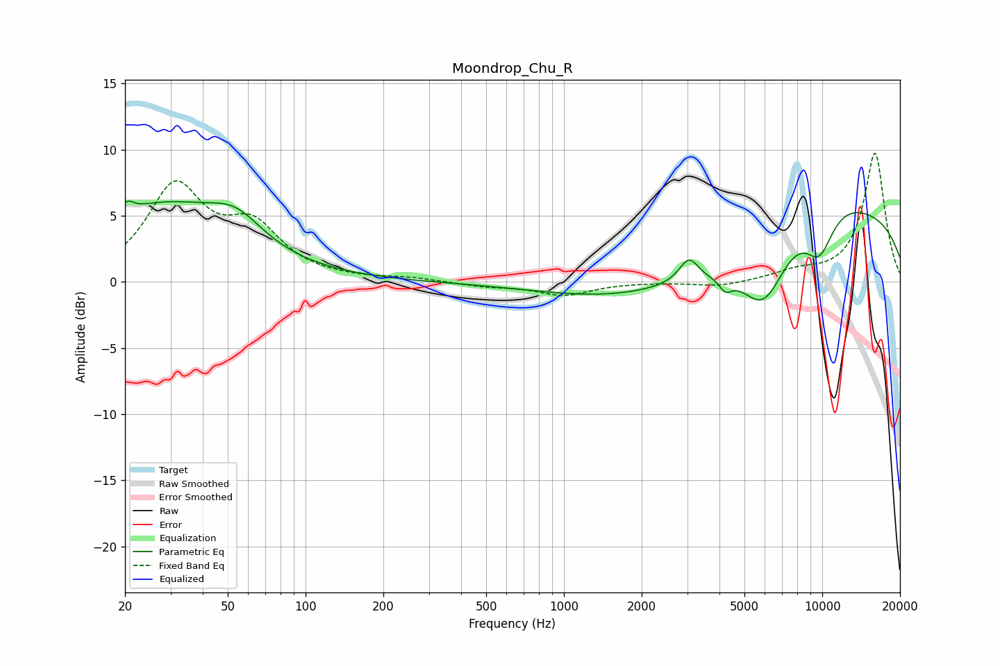

# Moondrop_Chu_R
See [usage instructions](https://github.com/jaakkopasanen/AutoEq#usage) for more options and info.

### Parametric EQs
Apply preamp of -6.2 dB when using parametric equalizer.

|   # | Type    |   Fc (Hz) |    Q |   Gain (dB) |
|-----|---------|-----------|------|-------------|
|   1 | Peaking |        20 | 5.83 |         0.9 |
|   2 | Peaking |        27 | 0.52 |         5.5 |
|   3 | Peaking |        54 | 1.36 |         2.1 |
|   4 | Peaking |      3047 | 3.79 |         1.8 |
|   5 | Peaking |      3249 | 0.32 |        -3.6 |
|   6 | Peaking |      4220 | 5.82 |        -0.9 |
|   7 | Peaking |      5945 | 1.55 |        -4.8 |
|   8 | Peaking |      9196 | 0.68 |         2.8 |
|   9 | Peaking |      9742 | 2.08 |        -3.6 |
|  10 | Peaking |      9828 | 0.18 |         5.5 |

### Fixed Band EQs
When using fixed band (also called graphic) equalizer, apply preamp of **-9.8 dB** (if available) and set gains manually with these parameters.

|   # | Type    |   Fc (Hz) |    Q |   Gain (dB) |
|-----|---------|-----------|------|-------------|
|   1 | Peaking |        31 | 1.41 |         6.9 |
|   2 | Peaking |        62 | 1.41 |         3.7 |
|   3 | Peaking |       125 | 1.41 |         0.1 |
|   4 | Peaking |       250 | 1.41 |         0.2 |
|   5 | Peaking |       500 | 1.41 |        -0.3 |
|   6 | Peaking |      1000 | 1.41 |        -1   |
|   7 | Peaking |      2000 | 1.41 |         0   |
|   8 | Peaking |      4000 | 1.41 |        -0.4 |
|   9 | Peaking |      8000 | 1.41 |         0.6 |
|  10 | Peaking |     16000 | 1.41 |         9.8 |

### Graphs

