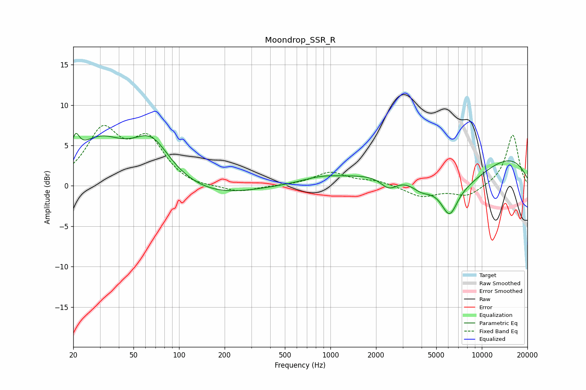

# Moondrop_SSR_R
See [usage instructions](https://github.com/jaakkopasanen/AutoEq#usage) for more options and info.

### Parametric EQs
Apply preamp of -6.6 dB when using parametric equalizer.

|   # | Type    |   Fc (Hz) |    Q |   Gain (dB) |
|-----|---------|-----------|------|-------------|
|   1 | Peaking |        21 | 5.82 |         2.4 |
|   2 | Peaking |        30 | 0.84 |         5.1 |
|   3 | Peaking |        66 | 1.15 |         4.9 |
|   4 | Peaking |       173 | 0.58 |        -1.3 |
|   5 | Peaking |       861 | 1.08 |         0.7 |
|   6 | Peaking |      2432 | 2.49 |        -1.6 |
|   7 | Peaking |      3976 | 2.31 |        -1   |
|   8 | Peaking |      6120 | 2.66 |        -3.4 |
|   9 | Peaking |      6345 | 0.51 |        -5.3 |
|  10 | Peaking |      8227 | 0.21 |         5.6 |

### Fixed Band EQs
When using fixed band (also called graphic) equalizer, apply preamp of **-7.6 dB** (if available) and set gains manually with these parameters.

|   # | Type    |   Fc (Hz) |    Q |   Gain (dB) |
|-----|---------|-----------|------|-------------|
|   1 | Peaking |        31 | 1.41 |         6.5 |
|   2 | Peaking |        62 | 1.41 |         5.3 |
|   3 | Peaking |       125 | 1.41 |        -0.4 |
|   4 | Peaking |       250 | 1.41 |        -0.8 |
|   5 | Peaking |       500 | 1.41 |        -0   |
|   6 | Peaking |      1000 | 1.41 |         1.6 |
|   7 | Peaking |      2000 | 1.41 |         0.6 |
|   8 | Peaking |      4000 | 1.41 |        -1.3 |
|   9 | Peaking |      8000 | 1.41 |        -1.3 |
|  10 | Peaking |     16000 | 1.41 |         6.4 |

### Graphs

