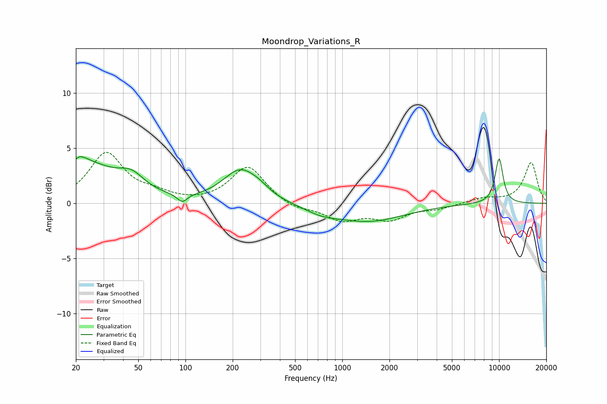

# Moondrop_Variations_R
See [usage instructions](https://github.com/jaakkopasanen/AutoEq#usage) for more options and info.

### Parametric EQs
Apply preamp of -4.3 dB when using parametric equalizer.

|   # | Type    |   Fc (Hz) |    Q |   Gain (dB) |
|-----|---------|-----------|------|-------------|
|   1 | Peaking |        22 | 5.47 |         3.1 |
|   2 | Peaking |        22 | 5.85 |        -2.6 |
|   3 | Peaking |        22 | 0.71 |         3.5 |
|   4 | Peaking |        45 | 1.73 |         1.4 |
|   5 | Peaking |        95 | 4.41 |        -0.8 |
|   6 | Peaking |       224 | 1.28 |         2.9 |
|   7 | Peaking |       296 | 2.26 |         0.4 |
|   8 | Peaking |       741 | 1.31 |        -0.6 |
|   9 | Peaking |      1477 | 0.63 |        -1.6 |
|  10 | Peaking |     10000 | 4.64 |         4.1 |

### Fixed Band EQs
When using fixed band (also called graphic) equalizer, apply preamp of **-4.7 dB** (if available) and set gains manually with these parameters.

|   # | Type    |   Fc (Hz) |    Q |   Gain (dB) |
|-----|---------|-----------|------|-------------|
|   1 | Peaking |        31 | 1.41 |         4.5 |
|   2 | Peaking |        62 | 1.41 |         0.7 |
|   3 | Peaking |       125 | 1.41 |        -0   |
|   4 | Peaking |       250 | 1.41 |         3.4 |
|   5 | Peaking |       500 | 1.41 |        -0.6 |
|   6 | Peaking |      1000 | 1.41 |        -1.4 |
|   7 | Peaking |      2000 | 1.41 |        -1.3 |
|   8 | Peaking |      4000 | 1.41 |        -0.4 |
|   9 | Peaking |      8000 | 1.41 |         0.5 |
|  10 | Peaking |     16000 | 1.41 |         3.7 |

### Graphs

