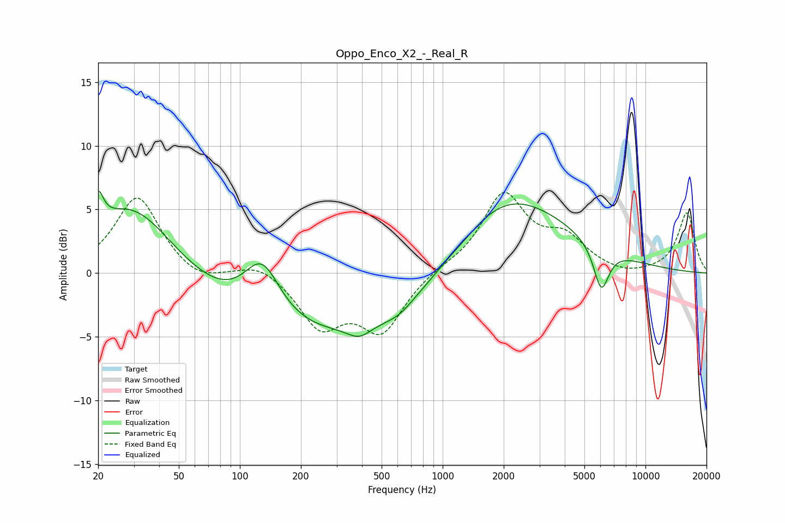

# Oppo_Enco_X2_-_Real_R
See [usage instructions](https://github.com/jaakkopasanen/AutoEq#usage) for more options and info.

### Parametric EQs
Apply preamp of -6.5 dB when using parametric equalizer.

|   # | Type    |   Fc (Hz) |    Q |   Gain (dB) |
|-----|---------|-----------|------|-------------|
|   1 | Peaking |        20 | 5.58 |         2.5 |
|   2 | Peaking |        29 | 0.69 |         5.7 |
|   3 | Peaking |       129 | 1.55 |         4.5 |
|   4 | Peaking |       346 | 0.18 |        -5.5 |
|   5 | Peaking |       388 | 2.35 |        -1   |
|   6 | Peaking |       642 | 1.45 |        -1.3 |
|   7 | Peaking |       704 | 2.6  |         0.3 |
|   8 | Peaking |      1279 | 1.58 |        -0.3 |
|   9 | Peaking |      1909 | 0.45 |         8.1 |
|  10 | Peaking |      6053 | 3.62 |        -3.5 |

### Fixed Band EQs
When using fixed band (also called graphic) equalizer, apply preamp of **-6.4 dB** (if available) and set gains manually with these parameters.

|   # | Type    |   Fc (Hz) |    Q |   Gain (dB) |
|-----|---------|-----------|------|-------------|
|   1 | Peaking |        31 | 1.41 |         6.1 |
|   2 | Peaking |        62 | 1.41 |        -0.9 |
|   3 | Peaking |       125 | 1.41 |         0.9 |
|   4 | Peaking |       250 | 1.41 |        -4   |
|   5 | Peaking |       500 | 1.41 |        -4.4 |
|   6 | Peaking |      1000 | 1.41 |         0.3 |
|   7 | Peaking |      2000 | 1.41 |         6   |
|   8 | Peaking |      4000 | 1.41 |         2.4 |
|   9 | Peaking |      8000 | 1.41 |        -0.4 |
|  10 | Peaking |     16000 | 1.41 |         4.7 |

### Graphs

