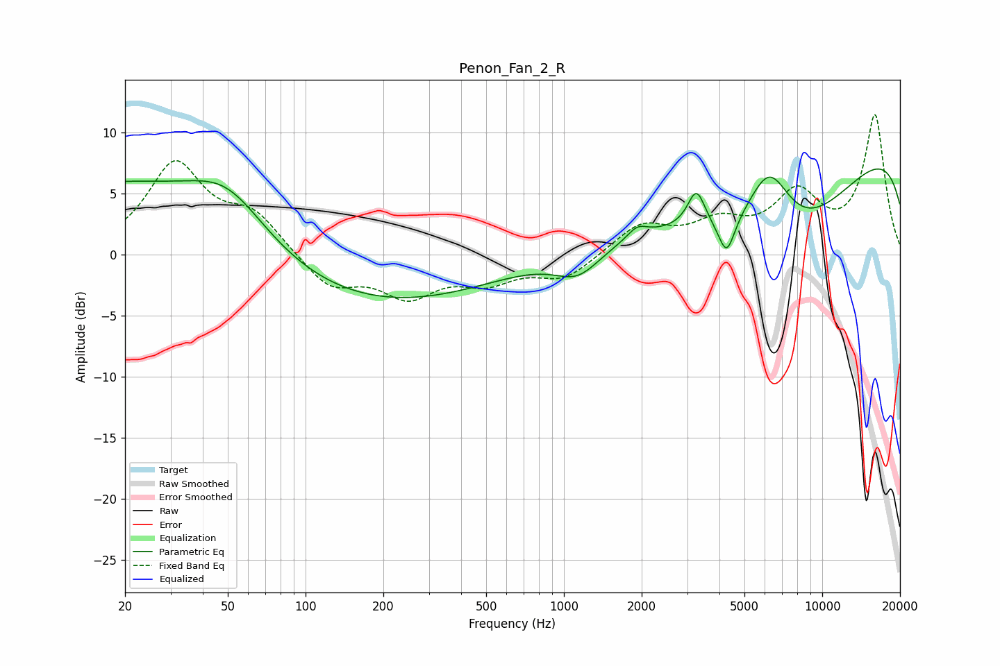

# Penon_Fan_2_R
See [usage instructions](https://github.com/jaakkopasanen/AutoEq#usage) for more options and info.

### Parametric EQs
Apply preamp of -7.1 dB when using parametric equalizer.

|   # | Type    |   Fc (Hz) |    Q |   Gain (dB) |
|-----|---------|-----------|------|-------------|
|   1 | Peaking |        20 | 0.29 |         6.1 |
|   2 | Peaking |        50 | 0.93 |         3.9 |
|   3 | Peaking |       150 | 0.26 |        -4.6 |
|   4 | Peaking |      1135 | 1.56 |        -2.3 |
|   5 | Peaking |      1926 | 3.68 |         0.9 |
|   6 | Peaking |      3259 | 4.2  |         3   |
|   7 | Peaking |      4265 | 4.48 |        -3   |
|   8 | Peaking |      6232 | 1.55 |         6.2 |
|   9 | Peaking |      7038 | 0.4  |       -11.9 |
|  10 | Peaking |     10000 | 0.18 |        12.8 |

### Fixed Band EQs
When using fixed band (also called graphic) equalizer, apply preamp of **-11.5 dB** (if available) and set gains manually with these parameters.

|   # | Type    |   Fc (Hz) |    Q |   Gain (dB) |
|-----|---------|-----------|------|-------------|
|   1 | Peaking |        31 | 1.41 |         7.3 |
|   2 | Peaking |        62 | 1.41 |         3   |
|   3 | Peaking |       125 | 1.41 |        -2.7 |
|   4 | Peaking |       250 | 1.41 |        -3.1 |
|   5 | Peaking |       500 | 1.41 |        -1.9 |
|   6 | Peaking |      1000 | 1.41 |        -1.9 |
|   7 | Peaking |      2000 | 1.41 |         2.4 |
|   8 | Peaking |      4000 | 1.41 |         2.2 |
|   9 | Peaking |      8000 | 1.41 |         4.6 |
|  10 | Peaking |     16000 | 1.41 |        11.3 |

### Graphs

