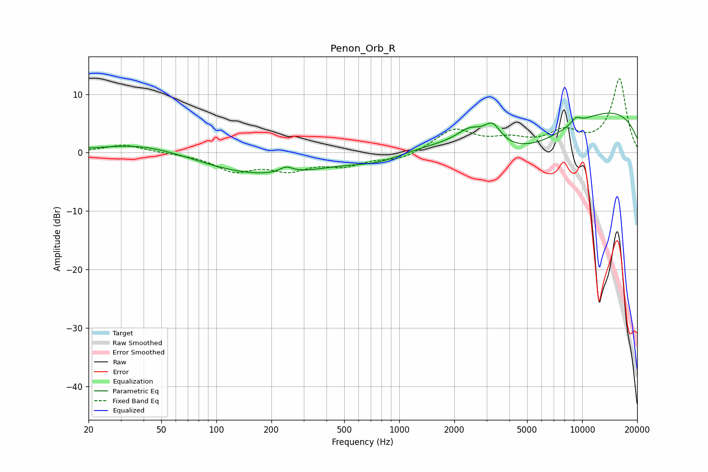

# Penon_Orb_R
See [usage instructions](https://github.com/jaakkopasanen/AutoEq#usage) for more options and info.

### Parametric EQs
Apply preamp of -6.9 dB when using parametric equalizer.

|   # | Type    |   Fc (Hz) |    Q |   Gain (dB) |
|-----|---------|-----------|------|-------------|
|   1 | Peaking |        37 | 1.14 |         0.2 |
|   2 | Peaking |        45 | 0.51 |         2   |
|   3 | Peaking |       168 | 0.38 |        -4   |
|   4 | Peaking |       241 | 3.99 |         1   |
|   5 | Peaking |       777 | 1.02 |        -1.4 |
|   6 | Peaking |      2431 | 2.03 |         2.4 |
|   7 | Peaking |      3238 | 3.12 |         3.2 |
|   8 | Peaking |      4852 | 0.5  |        -7.4 |
|   9 | Peaking |      8752 | 0.18 |         9.2 |
|  10 | Peaking |      9241 | 4.91 |         1.1 |

### Fixed Band EQs
When using fixed band (also called graphic) equalizer, apply preamp of **-12.7 dB** (if available) and set gains manually with these parameters.

|   # | Type    |   Fc (Hz) |    Q |   Gain (dB) |
|-----|---------|-----------|------|-------------|
|   1 | Peaking |        31 | 1.41 |         1.4 |
|   2 | Peaking |        62 | 1.41 |        -0.1 |
|   3 | Peaking |       125 | 1.41 |        -2.9 |
|   4 | Peaking |       250 | 1.41 |        -2.6 |
|   5 | Peaking |       500 | 1.41 |        -1.9 |
|   6 | Peaking |      1000 | 1.41 |        -1.2 |
|   7 | Peaking |      2000 | 1.41 |         3.9 |
|   8 | Peaking |      4000 | 1.41 |         1.8 |
|   9 | Peaking |      8000 | 1.41 |         3.1 |
|  10 | Peaking |     16000 | 1.41 |        12.6 |

### Graphs

