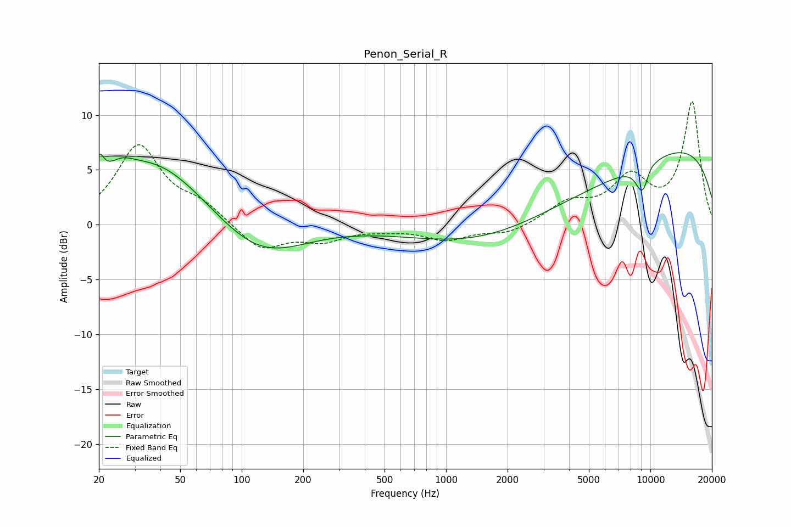

# Penon_Serial_R
See [usage instructions](https://github.com/jaakkopasanen/AutoEq#usage) for more options and info.

### Parametric EQs
Apply preamp of -6.7 dB when using parametric equalizer.

|   # | Type    |   Fc (Hz) |    Q |   Gain (dB) |
|-----|---------|-----------|------|-------------|
|   1 | Peaking |        20 | 5.96 |         2.3 |
|   2 | Peaking |        25 | 2.25 |         1.2 |
|   3 | Peaking |        37 | 0.55 |         6   |
|   4 | Peaking |       121 | 0.64 |        -3.5 |
|   5 | Peaking |       261 | 1.05 |         0.1 |
|   6 | Peaking |      3187 | 0.27 |        -4.4 |
|   7 | Peaking |      9096 | 5.76 |         1.7 |
|   8 | Peaking |      9113 | 4.53 |        -4.2 |
|   9 | Peaking |      9733 | 0.2  |         8.3 |
|  10 | Peaking |     10000 | 5.82 |         0.3 |

### Fixed Band EQs
When using fixed band (also called graphic) equalizer, apply preamp of **-11.3 dB** (if available) and set gains manually with these parameters.

|   # | Type    |   Fc (Hz) |    Q |   Gain (dB) |
|-----|---------|-----------|------|-------------|
|   1 | Peaking |        31 | 1.41 |         7.1 |
|   2 | Peaking |        62 | 1.41 |         1.6 |
|   3 | Peaking |       125 | 1.41 |        -2.4 |
|   4 | Peaking |       250 | 1.41 |        -1.3 |
|   5 | Peaking |       500 | 1.41 |        -0.3 |
|   6 | Peaking |      1000 | 1.41 |        -1.3 |
|   7 | Peaking |      2000 | 1.41 |        -0.8 |
|   8 | Peaking |      4000 | 1.41 |         1.9 |
|   9 | Peaking |      8000 | 1.41 |         4   |
|  10 | Peaking |     16000 | 1.41 |        11.1 |

### Graphs

