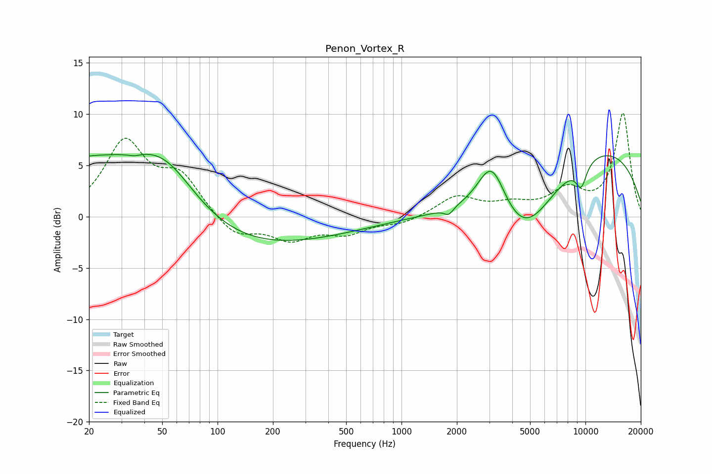

# Penon_Vortex_R
See [usage instructions](https://github.com/jaakkopasanen/AutoEq#usage) for more options and info.

### Parametric EQs
Apply preamp of -6.2 dB when using parametric equalizer.

|   # | Type    |   Fc (Hz) |    Q |   Gain (dB) |
|-----|---------|-----------|------|-------------|
|   1 | Peaking |        20 | 0.37 |         5.8 |
|   2 | Peaking |        35 | 4.37 |        -0.2 |
|   3 | Peaking |        51 | 0.79 |         5   |
|   4 | Peaking |        96 | 0.36 |        -1.2 |
|   5 | Peaking |       135 | 0.22 |        -2.4 |
|   6 | Peaking |      1807 | 5.79 |        -0.7 |
|   7 | Peaking |      3093 | 1.78 |         5.5 |
|   8 | Peaking |      4618 | 0.78 |        -7.1 |
|   9 | Peaking |      9492 | 4.14 |        -2.3 |
|  10 | Peaking |     10000 | 0.26 |         7.3 |

### Fixed Band EQs
When using fixed band (also called graphic) equalizer, apply preamp of **-10.2 dB** (if available) and set gains manually with these parameters.

|   # | Type    |   Fc (Hz) |    Q |   Gain (dB) |
|-----|---------|-----------|------|-------------|
|   1 | Peaking |        31 | 1.41 |         7.1 |
|   2 | Peaking |        62 | 1.41 |         3.6 |
|   3 | Peaking |       125 | 1.41 |        -2   |
|   4 | Peaking |       250 | 1.41 |        -2   |
|   5 | Peaking |       500 | 1.41 |        -1.5 |
|   6 | Peaking |      1000 | 1.41 |        -0.7 |
|   7 | Peaking |      2000 | 1.41 |         2   |
|   8 | Peaking |      4000 | 1.41 |         1   |
|   9 | Peaking |      8000 | 1.41 |         2.4 |
|  10 | Peaking |     16000 | 1.41 |        10   |

### Graphs

