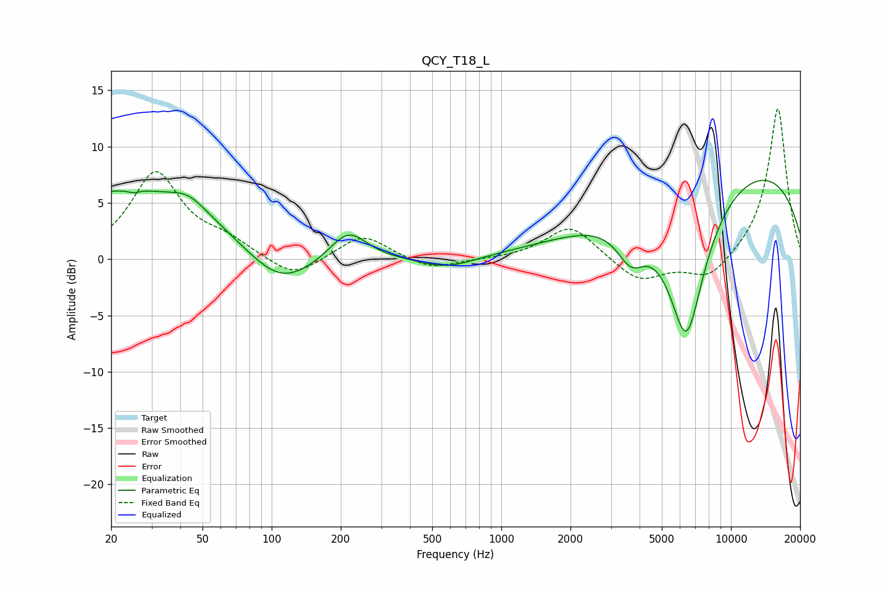

# QCY_T18_L
See [usage instructions](https://github.com/jaakkopasanen/AutoEq#usage) for more options and info.

### Parametric EQs
Apply preamp of -7.1 dB when using parametric equalizer.

|   # | Type    |   Fc (Hz) |    Q |   Gain (dB) |
|-----|---------|-----------|------|-------------|
|   1 | Peaking |        24 | 0.36 |         6.2 |
|   2 | Peaking |        25 | 5.15 |        -3   |
|   3 | Peaking |        25 | 5.06 |         2.8 |
|   4 | Peaking |        44 | 1.84 |         1.3 |
|   5 | Peaking |       109 | 0.96 |        -3.4 |
|   6 | Peaking |       215 | 1.75 |         2.7 |
|   7 | Peaking |       582 | 1.22 |        -1   |
|   8 | Peaking |      3673 | 2.22 |        -3.2 |
|   9 | Peaking |      6395 | 1.51 |       -14.1 |
|  10 | Peaking |     10000 | 0.23 |         8.8 |

### Fixed Band EQs
When using fixed band (also called graphic) equalizer, apply preamp of **-13.4 dB** (if available) and set gains manually with these parameters.

|   # | Type    |   Fc (Hz) |    Q |   Gain (dB) |
|-----|---------|-----------|------|-------------|
|   1 | Peaking |        31 | 1.41 |         7.6 |
|   2 | Peaking |        62 | 1.41 |         1.3 |
|   3 | Peaking |       125 | 1.41 |        -1.8 |
|   4 | Peaking |       250 | 1.41 |         2.2 |
|   5 | Peaking |       500 | 1.41 |        -1   |
|   6 | Peaking |      1000 | 1.41 |        -0   |
|   7 | Peaking |      2000 | 1.41 |         3   |
|   8 | Peaking |      4000 | 1.41 |        -2.1 |
|   9 | Peaking |      8000 | 1.41 |        -2   |
|  10 | Peaking |     16000 | 1.41 |        13.6 |

### Graphs

