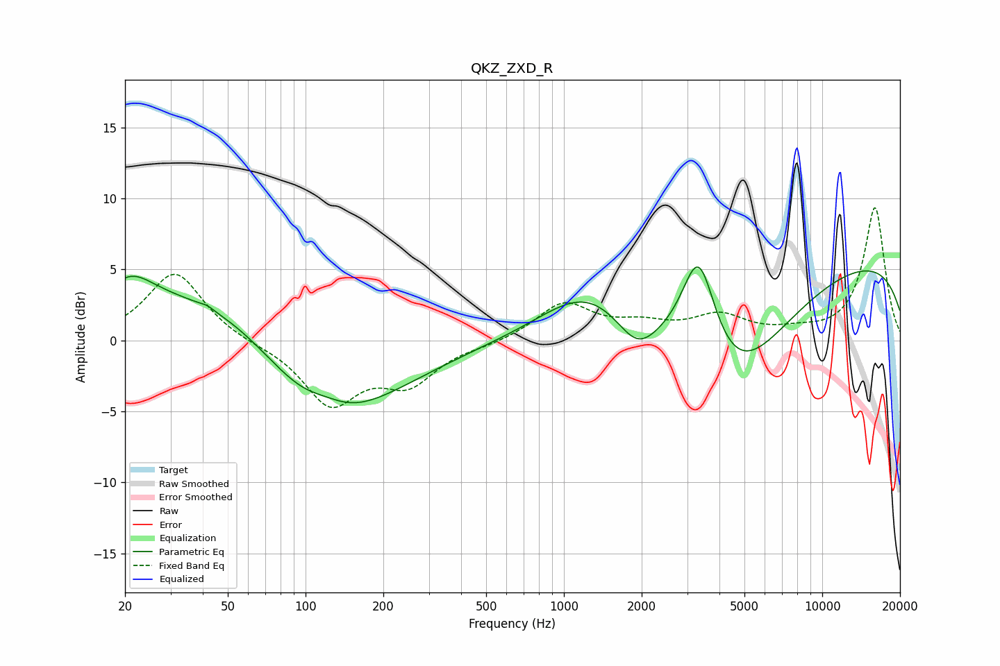

# QKZ_ZXD_R
See [usage instructions](https://github.com/jaakkopasanen/AutoEq#usage) for more options and info.

### Parametric EQs
Apply preamp of -5.3 dB when using parametric equalizer.

|   # | Type    |   Fc (Hz) |    Q |   Gain (dB) |
|-----|---------|-----------|------|-------------|
|   1 | Peaking |        21 | 1.48 |         2.5 |
|   2 | Peaking |        42 | 5.99 |         0.2 |
|   3 | Peaking |        54 | 0.4  |         5.5 |
|   4 | Peaking |       114 | 0.52 |        -8.7 |
|   5 | Peaking |       120 | 1.65 |         0.9 |
|   6 | Peaking |      1231 | 0.79 |         3.4 |
|   7 | Peaking |      1919 | 1.81 |        -2.3 |
|   8 | Peaking |      3327 | 2    |         8.1 |
|   9 | Peaking |      4323 | 0.62 |        -8.8 |
|  10 | Peaking |     10000 | 0.18 |         6.2 |

### Fixed Band EQs
When using fixed band (also called graphic) equalizer, apply preamp of **-9.4 dB** (if available) and set gains manually with these parameters.

|   # | Type    |   Fc (Hz) |    Q |   Gain (dB) |
|-----|---------|-----------|------|-------------|
|   1 | Peaking |        31 | 1.41 |         4.9 |
|   2 | Peaking |        62 | 1.41 |        -0.2 |
|   3 | Peaking |       125 | 1.41 |        -4.4 |
|   4 | Peaking |       250 | 1.41 |        -2.7 |
|   5 | Peaking |       500 | 1.41 |        -0.2 |
|   6 | Peaking |      1000 | 1.41 |         2.6 |
|   7 | Peaking |      2000 | 1.41 |         0.9 |
|   8 | Peaking |      4000 | 1.41 |         1.6 |
|   9 | Peaking |      8000 | 1.41 |         0.4 |
|  10 | Peaking |     16000 | 1.41 |         9.4 |

### Graphs

