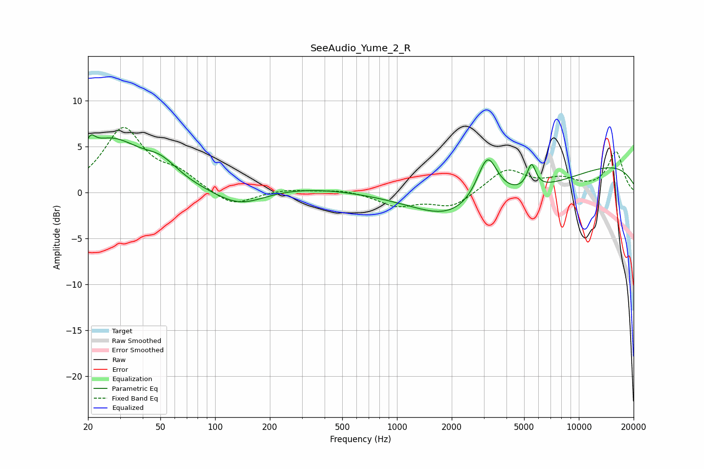

# SeeAudio_Yume_2_R
See [usage instructions](https://github.com/jaakkopasanen/AutoEq#usage) for more options and info.

### Parametric EQs
Apply preamp of -6.3 dB when using parametric equalizer.

|   # | Type    |   Fc (Hz) |    Q |   Gain (dB) |
|-----|---------|-----------|------|-------------|
|   1 | Peaking |        21 | 5.49 |         1.5 |
|   2 | Peaking |        27 | 0.83 |         5.4 |
|   3 | Peaking |        50 | 1.47 |         1.8 |
|   4 | Peaking |       137 | 1.01 |        -1.9 |
|   5 | Peaking |       282 | 0.43 |         0.7 |
|   6 | Peaking |      1910 | 0.85 |        -1.5 |
|   7 | Peaking |      3142 | 2.49 |         5.1 |
|   8 | Peaking |      3657 | 0.33 |        -3.8 |
|   9 | Peaking |      5492 | 5.78 |         2.6 |
|  10 | Peaking |      8868 | 0.19 |         3.9 |

### Fixed Band EQs
When using fixed band (also called graphic) equalizer, apply preamp of **-7.2 dB** (if available) and set gains manually with these parameters.

|   # | Type    |   Fc (Hz) |    Q |   Gain (dB) |
|-----|---------|-----------|------|-------------|
|   1 | Peaking |        31 | 1.41 |         6.8 |
|   2 | Peaking |        62 | 1.41 |         1.7 |
|   3 | Peaking |       125 | 1.41 |        -1.6 |
|   4 | Peaking |       250 | 1.41 |         0.4 |
|   5 | Peaking |       500 | 1.41 |         0.3 |
|   6 | Peaking |      1000 | 1.41 |        -1.4 |
|   7 | Peaking |      2000 | 1.41 |        -1.6 |
|   8 | Peaking |      4000 | 1.41 |         2.5 |
|   9 | Peaking |      8000 | 1.41 |         1.2 |
|  10 | Peaking |     16000 | 1.41 |         4.4 |

### Graphs

