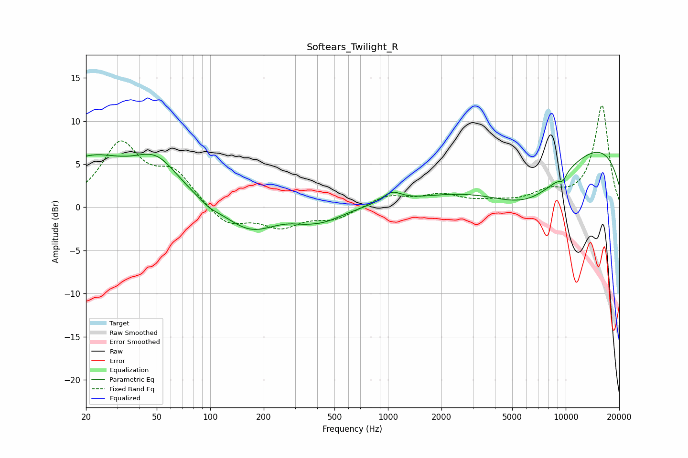

# Softears_Twilight_R
See [usage instructions](https://github.com/jaakkopasanen/AutoEq#usage) for more options and info.

### Parametric EQs
Apply preamp of -6.5 dB when using parametric equalizer.

|   # | Type    |   Fc (Hz) |    Q |   Gain (dB) |
|-----|---------|-----------|------|-------------|
|   1 | Peaking |        21 | 0.64 |         5.3 |
|   2 | Peaking |        50 | 1.1  |         4.2 |
|   3 | Peaking |        99 | 3.08 |        -0.4 |
|   4 | Peaking |       168 | 0.98 |        -2.9 |
|   5 | Peaking |       330 | 2.67 |        -0.2 |
|   6 | Peaking |       423 | 1.19 |        -1.5 |
|   7 | Peaking |      1051 | 2.65 |         1.2 |
|   8 | Peaking |      6172 | 0.51 |        -7.5 |
|   9 | Peaking |      9638 | 5.96 |        -0.8 |
|  10 | Peaking |      9963 | 0.21 |         9.3 |

### Fixed Band EQs
When using fixed band (also called graphic) equalizer, apply preamp of **-11.9 dB** (if available) and set gains manually with these parameters.

|   # | Type    |   Fc (Hz) |    Q |   Gain (dB) |
|-----|---------|-----------|------|-------------|
|   1 | Peaking |        31 | 1.41 |         7.1 |
|   2 | Peaking |        62 | 1.41 |         3.6 |
|   3 | Peaking |       125 | 1.41 |        -2.3 |
|   4 | Peaking |       250 | 1.41 |        -2.1 |
|   5 | Peaking |       500 | 1.41 |        -1.3 |
|   6 | Peaking |      1000 | 1.41 |         1.3 |
|   7 | Peaking |      2000 | 1.41 |         1.3 |
|   8 | Peaking |      4000 | 1.41 |         0.4 |
|   9 | Peaking |      8000 | 1.41 |         1.5 |
|  10 | Peaking |     16000 | 1.41 |        11.8 |

### Graphs

