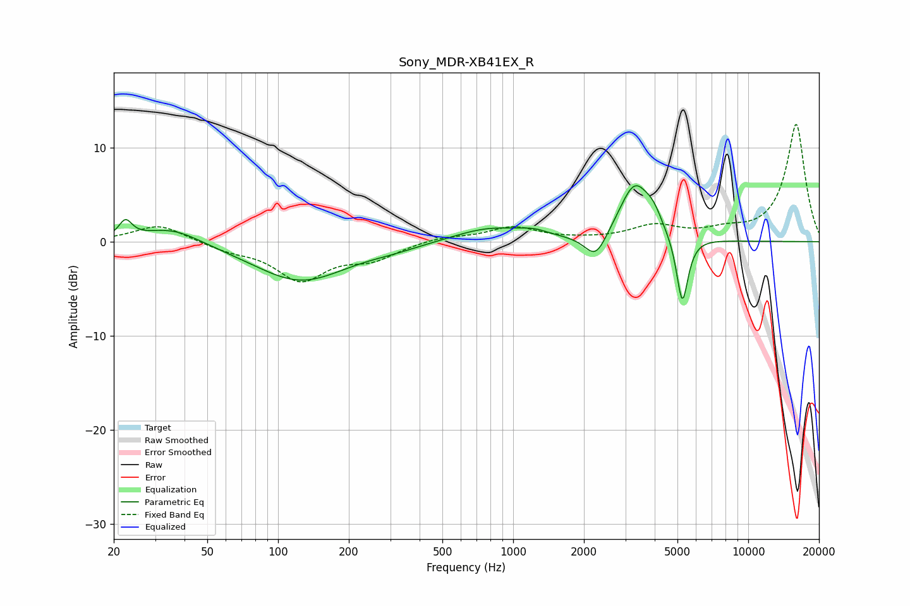

# Sony_MDR-XB41EX_R
See [usage instructions](https://github.com/jaakkopasanen/AutoEq#usage) for more options and info.

### Parametric EQs
Apply preamp of -6.0 dB when using parametric equalizer.

|   # | Type    |   Fc (Hz) |    Q |   Gain (dB) |
|-----|---------|-----------|------|-------------|
|   1 | Peaking |        22 | 5.13 |         1.8 |
|   2 | Peaking |        35 | 1.16 |         1.7 |
|   3 | Peaking |       125 | 0.72 |        -4.2 |
|   4 | Peaking |       312 | 1.3  |        -0.4 |
|   5 | Peaking |       791 | 0.95 |         1.5 |
|   6 | Peaking |      1223 | 2.34 |         0.6 |
|   7 | Peaking |      2246 | 2.94 |        -2.9 |
|   8 | Peaking |      3290 | 2.09 |         6.1 |
|   9 | Peaking |      3953 | 3.99 |         1.4 |
|  10 | Peaking |      5242 | 5.59 |        -7.4 |

### Fixed Band EQs
When using fixed band (also called graphic) equalizer, apply preamp of **-12.6 dB** (if available) and set gains manually with these parameters.

|   # | Type    |   Fc (Hz) |    Q |   Gain (dB) |
|-----|---------|-----------|------|-------------|
|   1 | Peaking |        31 | 1.41 |         1.9 |
|   2 | Peaking |        62 | 1.41 |        -0.8 |
|   3 | Peaking |       125 | 1.41 |        -3.9 |
|   4 | Peaking |       250 | 1.41 |        -1.6 |
|   5 | Peaking |       500 | 1.41 |         0.5 |
|   6 | Peaking |      1000 | 1.41 |         1.5 |
|   7 | Peaking |      2000 | 1.41 |         0.1 |
|   8 | Peaking |      4000 | 1.41 |         1.6 |
|   9 | Peaking |      8000 | 1.41 |         0.9 |
|  10 | Peaking |     16000 | 1.41 |        12.5 |

### Graphs

