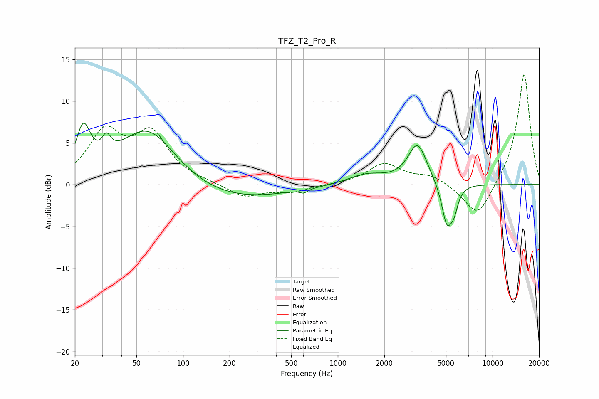

# TFZ_T2_Pro_R
See [usage instructions](https://github.com/jaakkopasanen/AutoEq#usage) for more options and info.

### Parametric EQs
Apply preamp of -7.5 dB when using parametric equalizer.

|   # | Type    |   Fc (Hz) |    Q |   Gain (dB) |
|-----|---------|-----------|------|-------------|
|   1 | Peaking |        23 | 3.06 |         5.4 |
|   2 | Peaking |        32 | 5.11 |         2   |
|   3 | Peaking |        59 | 0.75 |         7.2 |
|   4 | Peaking |       184 | 0.38 |        -2.1 |
|   5 | Peaking |       603 | 5.96 |        -0.4 |
|   6 | Peaking |      1537 | 1.17 |         1.2 |
|   7 | Peaking |      3274 | 2.29 |         4.8 |
|   8 | Peaking |      5077 | 3.98 |        -5   |
|   9 | Peaking |      5605 | 4.51 |         0.8 |
|  10 | Peaking |      5636 | 5.29 |        -2.7 |

### Fixed Band EQs
When using fixed band (also called graphic) equalizer, apply preamp of **-13.3 dB** (if available) and set gains manually with these parameters.

|   # | Type    |   Fc (Hz) |    Q |   Gain (dB) |
|-----|---------|-----------|------|-------------|
|   1 | Peaking |        31 | 1.41 |         5.9 |
|   2 | Peaking |        62 | 1.41 |         5.7 |
|   3 | Peaking |       125 | 1.41 |         0.2 |
|   4 | Peaking |       250 | 1.41 |        -1.5 |
|   5 | Peaking |       500 | 1.41 |        -0.8 |
|   6 | Peaking |      1000 | 1.41 |         0   |
|   7 | Peaking |      2000 | 1.41 |         2.4 |
|   8 | Peaking |      4000 | 1.41 |         1   |
|   9 | Peaking |      8000 | 1.41 |        -4.2 |
|  10 | Peaking |     16000 | 1.41 |        13.5 |

### Graphs

