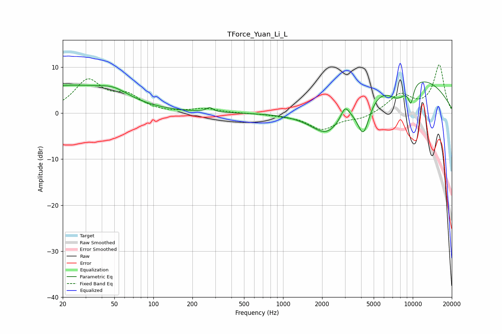

# TForce_Yuan_Li_L
See [usage instructions](https://github.com/jaakkopasanen/AutoEq#usage) for more options and info.

### Parametric EQs
Apply preamp of -6.9 dB when using parametric equalizer.

|   # | Type    |   Fc (Hz) |    Q |   Gain (dB) |
|-----|---------|-----------|------|-------------|
|   1 | Peaking |        21 | 0.4  |         5.7 |
|   2 | Peaking |        49 | 1.19 |         2   |
|   3 | Peaking |       272 | 5.67 |         1   |
|   4 | Peaking |      2055 | 0.6  |        -2   |
|   5 | Peaking |      2208 | 1.16 |        -5.7 |
|   6 | Peaking |      3005 | 4.59 |         2.5 |
|   7 | Peaking |      4162 | 2.78 |        -8.4 |
|   8 | Peaking |      7716 | 1.61 |        -4.4 |
|   9 | Peaking |      8035 | 0.28 |         9.1 |
|  10 | Peaking |      9674 | 6    |        -3.9 |

### Fixed Band EQs
When using fixed band (also called graphic) equalizer, apply preamp of **-10.6 dB** (if available) and set gains manually with these parameters.

|   # | Type    |   Fc (Hz) |    Q |   Gain (dB) |
|-----|---------|-----------|------|-------------|
|   1 | Peaking |        31 | 1.41 |         6.8 |
|   2 | Peaking |        62 | 1.41 |         3.2 |
|   3 | Peaking |       125 | 1.41 |        -0.1 |
|   4 | Peaking |       250 | 1.41 |         0.9 |
|   5 | Peaking |       500 | 1.41 |        -0   |
|   6 | Peaking |      1000 | 1.41 |        -0.3 |
|   7 | Peaking |      2000 | 1.41 |        -3.4 |
|   8 | Peaking |      4000 | 1.41 |        -1.2 |
|   9 | Peaking |      8000 | 1.41 |         3.9 |
|  10 | Peaking |     16000 | 1.41 |        10.4 |

### Graphs

