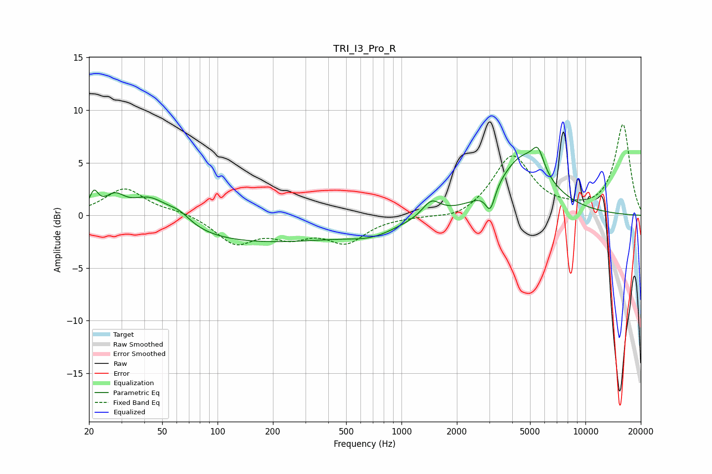

# TRI_I3_Pro_R
See [usage instructions](https://github.com/jaakkopasanen/AutoEq#usage) for more options and info.

### Parametric EQs
Apply preamp of -6.6 dB when using parametric equalizer.

|   # | Type    |   Fc (Hz) |    Q |   Gain (dB) |
|-----|---------|-----------|------|-------------|
|   1 | Peaking |        21 | 5.89 |         1.8 |
|   2 | Peaking |        28 | 2.58 |         1.7 |
|   3 | Peaking |        43 | 1.35 |         2.5 |
|   4 | Peaking |        62 | 2.08 |         1.1 |
|   5 | Peaking |       159 | 0.26 |        -2.6 |
|   6 | Peaking |       695 | 1.05 |        -1   |
|   7 | Peaking |      1452 | 2.94 |         1.5 |
|   8 | Peaking |      3038 | 5.54 |        -2.2 |
|   9 | Peaking |      4572 | 1.06 |         5.4 |
|  10 | Peaking |      5521 | 4.46 |         2   |

### Fixed Band EQs
When using fixed band (also called graphic) equalizer, apply preamp of **-8.7 dB** (if available) and set gains manually with these parameters.

|   # | Type    |   Fc (Hz) |    Q |   Gain (dB) |
|-----|---------|-----------|------|-------------|
|   1 | Peaking |        31 | 1.41 |         2.5 |
|   2 | Peaking |        62 | 1.41 |         0.4 |
|   3 | Peaking |       125 | 1.41 |        -2.5 |
|   4 | Peaking |       250 | 1.41 |        -1.6 |
|   5 | Peaking |       500 | 1.41 |        -2.4 |
|   6 | Peaking |      1000 | 1.41 |        -0.1 |
|   7 | Peaking |      2000 | 1.41 |        -0.6 |
|   8 | Peaking |      4000 | 1.41 |         5.6 |
|   9 | Peaking |      8000 | 1.41 |         0.3 |
|  10 | Peaking |     16000 | 1.41 |         8.6 |

### Graphs

