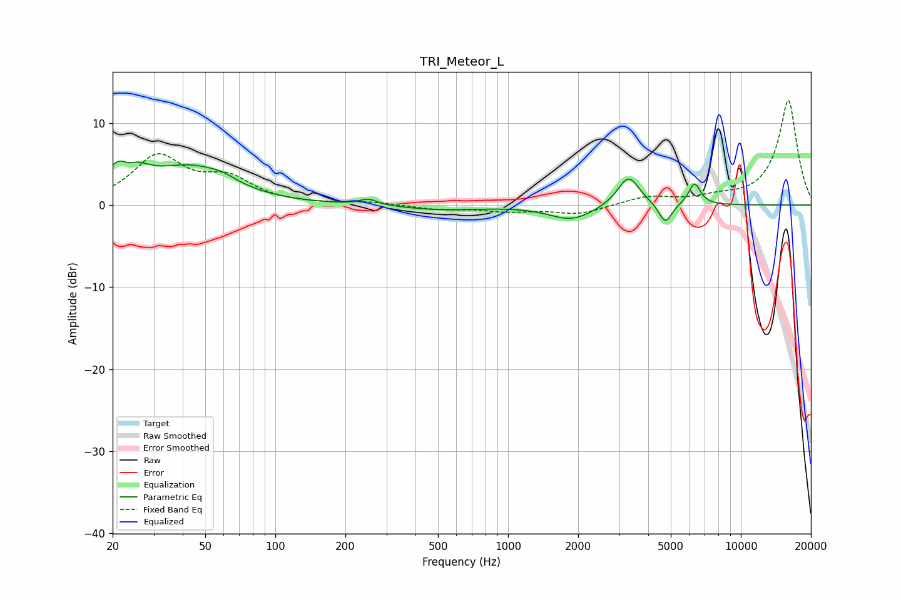

# TRI_Meteor_L
See [usage instructions](https://github.com/jaakkopasanen/AutoEq#usage) for more options and info.

### Parametric EQs
Apply preamp of -5.5 dB when using parametric equalizer.

|   # | Type    |   Fc (Hz) |    Q |   Gain (dB) |
|-----|---------|-----------|------|-------------|
|   1 | Peaking |        23 | 2.03 |         5.2 |
|   2 | Peaking |        23 | 4.36 |        -1.8 |
|   3 | Peaking |        44 | 0.85 |         4.2 |
|   4 | Peaking |        59 | 2.41 |         0.6 |
|   5 | Peaking |       251 | 3.64 |         0.7 |
|   6 | Peaking |       518 | 0.84 |        -0.6 |
|   7 | Peaking |      1872 | 1.5  |        -1.8 |
|   8 | Peaking |      3293 | 2.98 |         3.7 |
|   9 | Peaking |      4737 | 5.01 |        -2.5 |
|  10 | Peaking |      6326 | 5.37 |         2.7 |

### Fixed Band EQs
When using fixed band (also called graphic) equalizer, apply preamp of **-12.8 dB** (if available) and set gains manually with these parameters.

|   # | Type    |   Fc (Hz) |    Q |   Gain (dB) |
|-----|---------|-----------|------|-------------|
|   1 | Peaking |        31 | 1.41 |         5.7 |
|   2 | Peaking |        62 | 1.41 |         2.9 |
|   3 | Peaking |       125 | 1.41 |         0   |
|   4 | Peaking |       250 | 1.41 |         0.3 |
|   5 | Peaking |       500 | 1.41 |        -0.5 |
|   6 | Peaking |      1000 | 1.41 |        -0.7 |
|   7 | Peaking |      2000 | 1.41 |        -1.1 |
|   8 | Peaking |      4000 | 1.41 |         1   |
|   9 | Peaking |      8000 | 1.41 |         0.7 |
|  10 | Peaking |     16000 | 1.41 |        12.8 |

### Graphs

