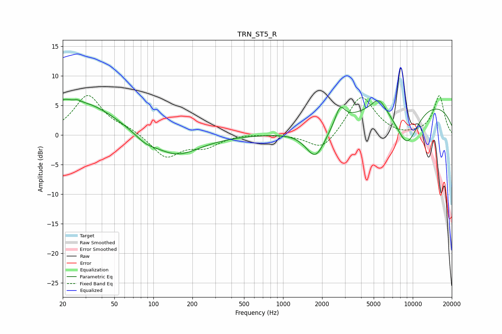

# TRN_ST5_R
See [usage instructions](https://github.com/jaakkopasanen/AutoEq#usage) for more options and info.

### Parametric EQs
Apply preamp of -6.1 dB when using parametric equalizer.

|   # | Type    |   Fc (Hz) |    Q |   Gain (dB) |
|-----|---------|-----------|------|-------------|
|   1 | Peaking |        20 | 2.67 |         1.4 |
|   2 | Peaking |        26 | 5.93 |         0.3 |
|   3 | Peaking |        29 | 0.56 |         5.4 |
|   4 | Peaking |        86 | 1.8  |        -1.1 |
|   5 | Peaking |       150 | 0.78 |        -3.6 |
|   6 | Peaking |      1783 | 1.84 |        -5.3 |
|   7 | Peaking |      2753 | 3.89 |         2.9 |
|   8 | Peaking |      5477 | 2.44 |         2.5 |
|   9 | Peaking |      9017 | 1.36 |        -7.1 |
|  10 | Peaking |     10000 | 0.22 |         5.9 |

### Fixed Band EQs
When using fixed band (also called graphic) equalizer, apply preamp of **-6.8 dB** (if available) and set gains manually with these parameters.

|   # | Type    |   Fc (Hz) |    Q |   Gain (dB) |
|-----|---------|-----------|------|-------------|
|   1 | Peaking |        31 | 1.41 |         6.6 |
|   2 | Peaking |        62 | 1.41 |         0.9 |
|   3 | Peaking |       125 | 1.41 |        -3.8 |
|   4 | Peaking |       250 | 1.41 |        -1.8 |
|   5 | Peaking |       500 | 1.41 |         0.2 |
|   6 | Peaking |      1000 | 1.41 |         0.1 |
|   7 | Peaking |      2000 | 1.41 |        -2.9 |
|   8 | Peaking |      4000 | 1.41 |         6.8 |
|   9 | Peaking |      8000 | 1.41 |        -0.4 |
|  10 | Peaking |     16000 | 1.41 |         6.6 |

### Graphs

