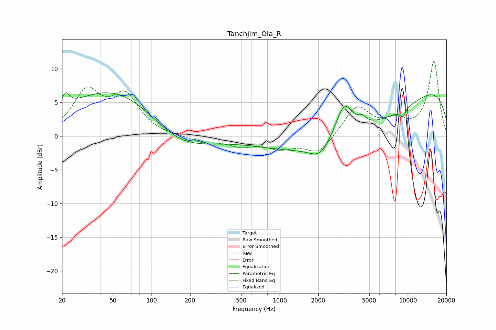

# Tanchjim_Ola_R
See [usage instructions](https://github.com/jaakkopasanen/AutoEq#usage) for more options and info.

### Parametric EQs
Apply preamp of -6.5 dB when using parametric equalizer.

|   # | Type    |   Fc (Hz) |    Q |   Gain (dB) |
|-----|---------|-----------|------|-------------|
|   1 | Peaking |        21 | 5.09 |         2   |
|   2 | Peaking |        55 | 0.35 |         7.5 |
|   3 | Peaking |       158 | 0.57 |        -4.1 |
|   4 | Peaking |      2076 | 1.75 |        -2.3 |
|   5 | Peaking |      3187 | 2.03 |         5.1 |
|   6 | Peaking |      3961 | 0.26 |        -8   |
|   7 | Peaking |      4437 | 5.04 |         0.8 |
|   8 | Peaking |      8082 | 0.18 |         5.1 |
|   9 | Peaking |      9146 | 5.56 |        -1.2 |
|  10 | Peaking |      9655 | 0.18 |         4.7 |

### Fixed Band EQs
When using fixed band (also called graphic) equalizer, apply preamp of **-11.2 dB** (if available) and set gains manually with these parameters.

|   # | Type    |   Fc (Hz) |    Q |   Gain (dB) |
|-----|---------|-----------|------|-------------|
|   1 | Peaking |        31 | 1.41 |         6.2 |
|   2 | Peaking |        62 | 1.41 |         5.5 |
|   3 | Peaking |       125 | 1.41 |        -0.1 |
|   4 | Peaking |       250 | 1.41 |        -0.9 |
|   5 | Peaking |       500 | 1.41 |        -1.3 |
|   6 | Peaking |      1000 | 1.41 |        -1.6 |
|   7 | Peaking |      2000 | 1.41 |        -2.7 |
|   8 | Peaking |      4000 | 1.41 |         4.4 |
|   9 | Peaking |      8000 | 1.41 |         1.8 |
|  10 | Peaking |     16000 | 1.41 |        11   |

### Graphs

