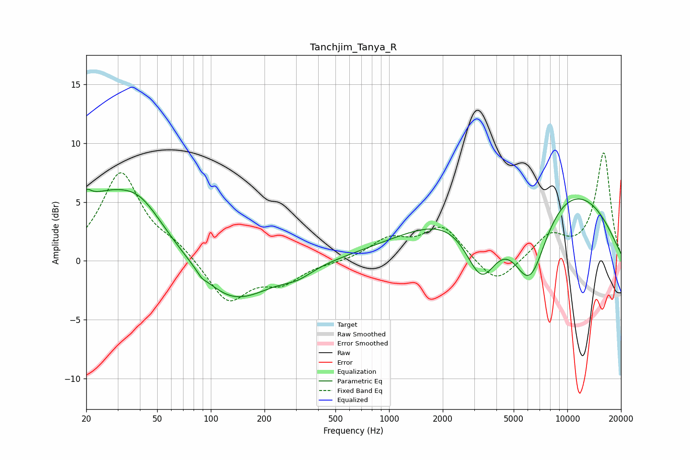

# Tanchjim_Tanya_R
See [usage instructions](https://github.com/jaakkopasanen/AutoEq#usage) for more options and info.

### Parametric EQs
Apply preamp of -6.2 dB when using parametric equalizer.

|   # | Type    |   Fc (Hz) |    Q |   Gain (dB) |
|-----|---------|-----------|------|-------------|
|   1 | Peaking |        20 | 5.55 |         0.9 |
|   2 | Peaking |        28 | 0.52 |         5.7 |
|   3 | Peaking |        41 | 1.35 |         1.3 |
|   4 | Peaking |        89 | 5.75 |        -0.3 |
|   5 | Peaking |       129 | 0.67 |        -4   |
|   6 | Peaking |       307 | 1.69 |        -0.7 |
|   7 | Peaking |      2248 | 0.37 |         1.9 |
|   8 | Peaking |      3302 | 1.46 |        -6   |
|   9 | Peaking |      6146 | 1.27 |        -8.2 |
|  10 | Peaking |      7660 | 0.3  |         7.4 |

### Fixed Band EQs
When using fixed band (also called graphic) equalizer, apply preamp of **-9.3 dB** (if available) and set gains manually with these parameters.

|   # | Type    |   Fc (Hz) |    Q |   Gain (dB) |
|-----|---------|-----------|------|-------------|
|   1 | Peaking |        31 | 1.41 |         7.4 |
|   2 | Peaking |        62 | 1.41 |         1.1 |
|   3 | Peaking |       125 | 1.41 |        -3.5 |
|   4 | Peaking |       250 | 1.41 |        -1.7 |
|   5 | Peaking |       500 | 1.41 |        -0.1 |
|   6 | Peaking |      1000 | 1.41 |         1.7 |
|   7 | Peaking |      2000 | 1.41 |         2.8 |
|   8 | Peaking |      4000 | 1.41 |        -2.2 |
|   9 | Peaking |      8000 | 1.41 |         2.1 |
|  10 | Peaking |     16000 | 1.41 |         9.1 |

### Graphs

