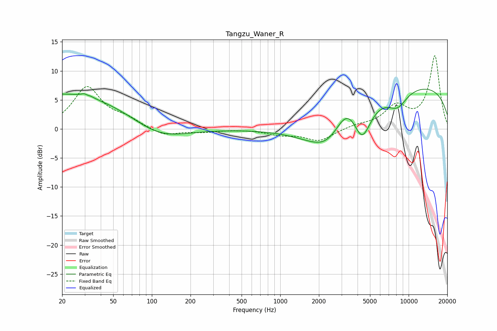

# Tangzu_Waner_R
See [usage instructions](https://github.com/jaakkopasanen/AutoEq#usage) for more options and info.

### Parametric EQs
Apply preamp of -6.9 dB when using parametric equalizer.

|   # | Type    |   Fc (Hz) |    Q |   Gain (dB) |
|-----|---------|-----------|------|-------------|
|   1 | Peaking |        20 | 0.23 |         6.1 |
|   2 | Peaking |        31 | 5.18 |         2.9 |
|   3 | Peaking |        31 | 5.94 |        -2.5 |
|   4 | Peaking |        63 | 0.18 |         0.1 |
|   5 | Peaking |       111 | 0.65 |        -3.1 |
|   6 | Peaking |      2505 | 0.75 |        -8.9 |
|   7 | Peaking |      3300 | 1.16 |         6.9 |
|   8 | Peaking |      4330 | 1.99 |        -6.8 |
|   9 | Peaking |      8177 | 1.69 |        -2.9 |
|  10 | Peaking |      9974 | 0.2  |         7.7 |

### Fixed Band EQs
When using fixed band (also called graphic) equalizer, apply preamp of **-12.7 dB** (if available) and set gains manually with these parameters.

|   # | Type    |   Fc (Hz) |    Q |   Gain (dB) |
|-----|---------|-----------|------|-------------|
|   1 | Peaking |        31 | 1.41 |         7.1 |
|   2 | Peaking |        62 | 1.41 |         1.4 |
|   3 | Peaking |       125 | 1.41 |        -1.2 |
|   4 | Peaking |       250 | 1.41 |        -0.5 |
|   5 | Peaking |       500 | 1.41 |        -0   |
|   6 | Peaking |      1000 | 1.41 |        -0.9 |
|   7 | Peaking |      2000 | 1.41 |        -2   |
|   8 | Peaking |      4000 | 1.41 |         0.5 |
|   9 | Peaking |      8000 | 1.41 |         3.6 |
|  10 | Peaking |     16000 | 1.41 |        12.5 |

### Graphs

