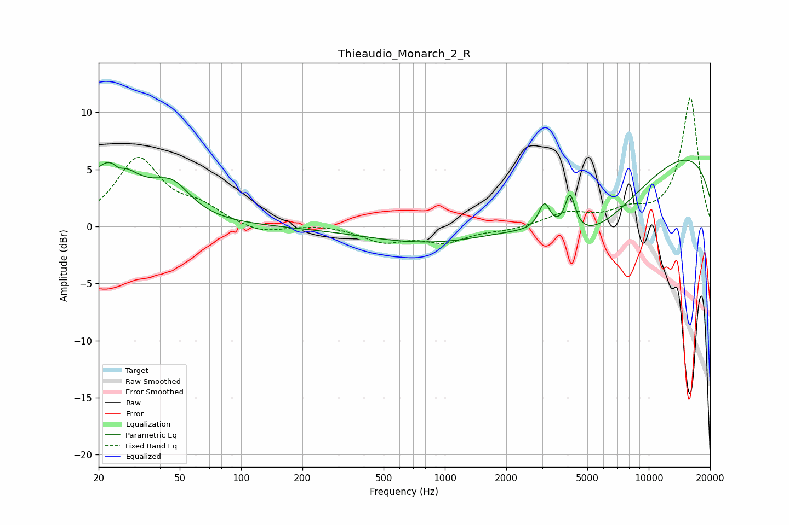

# Thieaudio_Monarch_2_R
See [usage instructions](https://github.com/jaakkopasanen/AutoEq#usage) for more options and info.

### Parametric EQs
Apply preamp of -5.9 dB when using parametric equalizer.

|   # | Type    |   Fc (Hz) |    Q |   Gain (dB) |
|-----|---------|-----------|------|-------------|
|   1 | Peaking |        23 | 1.1  |         5.5 |
|   2 | Peaking |        25 | 5.73 |        -2.2 |
|   3 | Peaking |        26 | 5.87 |         1.6 |
|   4 | Peaking |        46 | 1.55 |         2.6 |
|   5 | Peaking |      2723 | 0.18 |        -2.9 |
|   6 | Peaking |      3064 | 5.99 |        -0.9 |
|   7 | Peaking |      3074 | 5.22 |         3.3 |
|   8 | Peaking |      4113 | 5.54 |         3.2 |
|   9 | Peaking |      5104 | 0.58 |        -5   |
|  10 | Peaking |      9540 | 0.18 |         8.1 |

### Fixed Band EQs
When using fixed band (also called graphic) equalizer, apply preamp of **-11.4 dB** (if available) and set gains manually with these parameters.

|   # | Type    |   Fc (Hz) |    Q |   Gain (dB) |
|-----|---------|-----------|------|-------------|
|   1 | Peaking |        31 | 1.41 |         5.8 |
|   2 | Peaking |        62 | 1.41 |         1.4 |
|   3 | Peaking |       125 | 1.41 |        -0.7 |
|   4 | Peaking |       250 | 1.41 |         0.2 |
|   5 | Peaking |       500 | 1.41 |        -1.3 |
|   6 | Peaking |      1000 | 1.41 |        -1.3 |
|   7 | Peaking |      2000 | 1.41 |        -0.3 |
|   8 | Peaking |      4000 | 1.41 |         1.1 |
|   9 | Peaking |      8000 | 1.41 |         1.1 |
|  10 | Peaking |     16000 | 1.41 |        11.3 |

### Graphs

