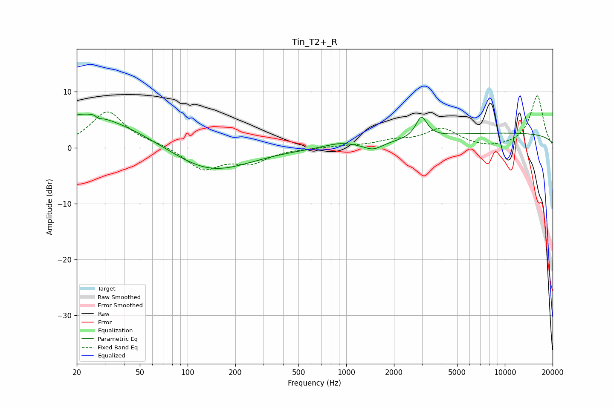

# Tin_T2+_R
See [usage instructions](https://github.com/jaakkopasanen/AutoEq#usage) for more options and info.

### Parametric EQs
Apply preamp of -6.1 dB when using parametric equalizer.

|   # | Type    |   Fc (Hz) |    Q |   Gain (dB) |
|-----|---------|-----------|------|-------------|
|   1 | Peaking |        21 | 1.61 |         1   |
|   2 | Peaking |        26 | 0.44 |         5.4 |
|   3 | Peaking |        27 | 5.14 |         3.4 |
|   4 | Peaking |        27 | 5.55 |        -3.5 |
|   5 | Peaking |        74 | 1.39 |         0   |
|   6 | Peaking |       138 | 0.58 |        -4.6 |
|   7 | Peaking |       913 | 1.5  |         0.8 |
|   8 | Peaking |      1481 | 2.42 |        -1.2 |
|   9 | Peaking |      2980 | 4.06 |         3.8 |
|  10 | Peaking |     10000 | 0.18 |         2.6 |

### Fixed Band EQs
When using fixed band (also called graphic) equalizer, apply preamp of **-9.4 dB** (if available) and set gains manually with these parameters.

|   # | Type    |   Fc (Hz) |    Q |   Gain (dB) |
|-----|---------|-----------|------|-------------|
|   1 | Peaking |        31 | 1.41 |         6.4 |
|   2 | Peaking |        62 | 1.41 |         0.6 |
|   3 | Peaking |       125 | 1.41 |        -3.8 |
|   4 | Peaking |       250 | 1.41 |        -2.4 |
|   5 | Peaking |       500 | 1.41 |        -0   |
|   6 | Peaking |      1000 | 1.41 |         0.3 |
|   7 | Peaking |      2000 | 1.41 |         1.1 |
|   8 | Peaking |      4000 | 1.41 |         3.3 |
|   9 | Peaking |      8000 | 1.41 |        -0.4 |
|  10 | Peaking |     16000 | 1.41 |         9.3 |

### Graphs

