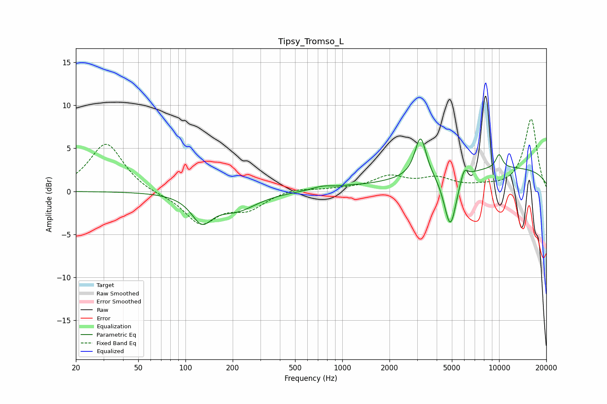

# Tipsy_Tromso_L
See [usage instructions](https://github.com/jaakkopasanen/AutoEq#usage) for more options and info.

### Parametric EQs
Apply preamp of -6.2 dB when using parametric equalizer.

|   # | Type    |   Fc (Hz) |    Q |   Gain (dB) |
|-----|---------|-----------|------|-------------|
|   1 | Peaking |       127 | 2.17 |        -3   |
|   2 | Peaking |       211 | 1.1  |        -2   |
|   3 | Peaking |       750 | 2.01 |         0.3 |
|   4 | Peaking |       927 | 2.4  |        -0.5 |
|   5 | Peaking |       936 | 1.82 |         0.7 |
|   6 | Peaking |      3156 | 4    |         4.8 |
|   7 | Peaking |      4886 | 3.42 |        -6.6 |
|   8 | Peaking |      5971 | 5.72 |         1.5 |
|   9 | Peaking |     10000 | 5.56 |         1.6 |
|  10 | Peaking |     10000 | 0.19 |         2.8 |

### Fixed Band EQs
When using fixed band (also called graphic) equalizer, apply preamp of **-8.5 dB** (if available) and set gains manually with these parameters.

|   # | Type    |   Fc (Hz) |    Q |   Gain (dB) |
|-----|---------|-----------|------|-------------|
|   1 | Peaking |        31 | 1.41 |         5.7 |
|   2 | Peaking |        62 | 1.41 |        -0.3 |
|   3 | Peaking |       125 | 1.41 |        -3.7 |
|   4 | Peaking |       250 | 1.41 |        -1.8 |
|   5 | Peaking |       500 | 1.41 |         0.4 |
|   6 | Peaking |      1000 | 1.41 |         0.2 |
|   7 | Peaking |      2000 | 1.41 |         1.6 |
|   8 | Peaking |      4000 | 1.41 |         1.3 |
|   9 | Peaking |      8000 | 1.41 |         0.4 |
|  10 | Peaking |     16000 | 1.41 |         8.4 |

### Graphs

