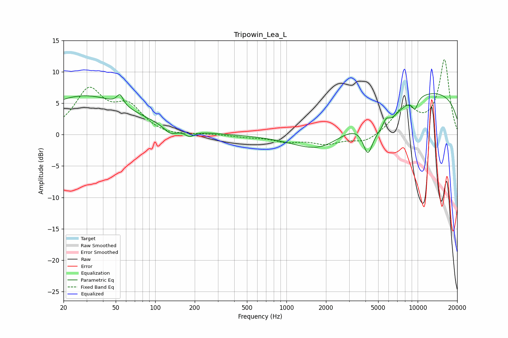

# Tripowin_Lea_L
See [usage instructions](https://github.com/jaakkopasanen/AutoEq#usage) for more options and info.

### Parametric EQs
Apply preamp of -6.6 dB when using parametric equalizer.

|   # | Type    |   Fc (Hz) |    Q |   Gain (dB) |
|-----|---------|-----------|------|-------------|
|   1 | Peaking |        29 | 0.41 |         6.2 |
|   2 | Peaking |        54 | 5.79 |         1.7 |
|   3 | Peaking |       131 | 2.89 |        -1.2 |
|   4 | Peaking |       183 | 4.27 |        -0.9 |
|   5 | Peaking |      1873 | 0.67 |        -4.6 |
|   6 | Peaking |      4171 | 3.83 |        -4.4 |
|   7 | Peaking |      5492 | 1.21 |        -4.2 |
|   8 | Peaking |      5738 | 5.41 |         1.5 |
|   9 | Peaking |      9528 | 5.43 |        -1.8 |
|  10 | Peaking |      9911 | 0.18 |         7.2 |

### Fixed Band EQs
When using fixed band (also called graphic) equalizer, apply preamp of **-12.0 dB** (if available) and set gains manually with these parameters.

|   # | Type    |   Fc (Hz) |    Q |   Gain (dB) |
|-----|---------|-----------|------|-------------|
|   1 | Peaking |        31 | 1.41 |         6.8 |
|   2 | Peaking |        62 | 1.41 |         4   |
|   3 | Peaking |       125 | 1.41 |        -0.4 |
|   4 | Peaking |       250 | 1.41 |         0.1 |
|   5 | Peaking |       500 | 1.41 |        -0.3 |
|   6 | Peaking |      1000 | 1.41 |        -1   |
|   7 | Peaking |      2000 | 1.41 |        -1.4 |
|   8 | Peaking |      4000 | 1.41 |        -1.3 |
|   9 | Peaking |      8000 | 1.41 |         4.2 |
|  10 | Peaking |     16000 | 1.41 |        11.8 |

### Graphs

